# Phishing Unfolding — SOC Investigation

## Case overview

This case study documents an investigation in the **Phishing Unfolding** SOC simulation. The available material consists of 65 screenshots captured on **8 and 12 September 2026**. The screenshot dates identify capture sessions; they do not, by themselves, prove that every image belongs to one continuous incident replay.

The screenshots show a queue of email and process alerts, SIEM searches, Sysmon events, and analyst classification examples. The most significant chain in the 12 September evidence starts with a suspicious invoice-themed email and includes a PowerShell command that references a downloaded remote-shell tool, local reconnaissance, access to a file share, file copying, and repeated DNS lookups. These observations support a **true-positive assessment of malicious endpoint activity** in the simulation. The screenshots alone do not prove that data left the environment.

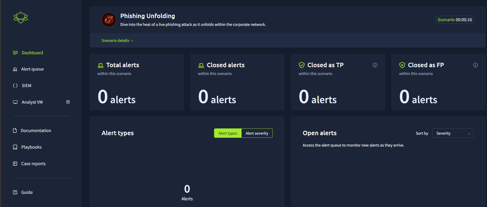

## Scope and method

- **Primary data sources:** email alert details, SIEM searches, and Sysmon process, file-creation, and DNS events.
- **Primary host in the suspicious chain:** `win-3450`.
- **Related user context visible in paths and email events:** `michael.ascot`.
- **Additional host reviewed for comparison:** `win-3451`.
- **Evidence archive:** [all screenshots, ordered by capture time](../evidence/phishing-unfolding/README.md).

The analysis pivots from the email sender and attachment to the recipient's endpoint activity, then follows process ancestry and command lines through the share-access and DNS events. It separates an alert's rule name from what the underlying event actually establishes.

## Alert triage

The alert queue includes low-severity detections for mail from unusual external domains. Such a rule can produce both useful leads and noise. One screenshot records an invoice-themed message with a ZIP attachment, addressed to `michael.ascot@tryhatme.com`; the 12 September SIEM view shows the same sender and attachment pattern. The attachment and urgent payment language justify investigation, but the email record alone does not establish that the recipient opened or executed it. [Alert detail](../evidence/phishing-unfolding/2026-09-08/212130.png) · [SIEM email event](../evidence/phishing-unfolding/2026-09-12/221702.png)

Other screenshots show why alerts need event-level validation. An analyst note classifies a `TrustedInstaller.exe` parent-child alert as a false positive after reviewing its path and related activity. `taskhostw.exe` with `KEYROAMING` under `svchost.exe` is also inspected as a comparison point; its rule name alone is not evidence of compromise. [False-positive rationale](../evidence/phishing-unfolding/2026-09-08/211905.png) · [Taskhost search](../evidence/phishing-unfolding/2026-09-12/221222.png)

## Alert-by-alert evidence

I reviewed each original alert card and the related SIEM screenshots, then recorded my SOC classification immediately after its evidence. True Positive means the specific phishing attempt or suspicious host activity is supported by the shown records; it does not imply a successful compromise or data transfer. False Positive means the alert's malicious interpretation is unsupported by the available context. Some SIEM views support multiple alerts and are repeated where needed. Screenshot capture times and event times are distinct; the 8 and 12 September records are not assumed to be one continuous replay.

### Alert 1000 — Suspicious email from an external domain

**Finding:** An inbound message from `trendymillineryco.me` has no attachment. The SIEM also shows an outbound message to that domain; the reputation screenshot reports no vendor detections at that time.

**Evidence**

**Alert detail — captured 2026-09-08 21:04:24**

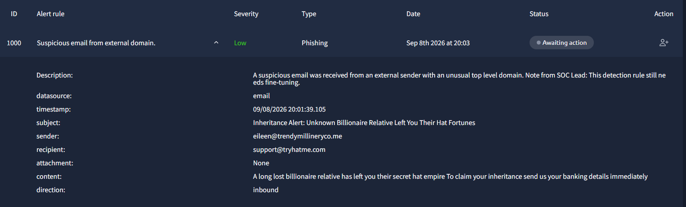

**Inbound email event — captured 2026-09-08 21:06:05**

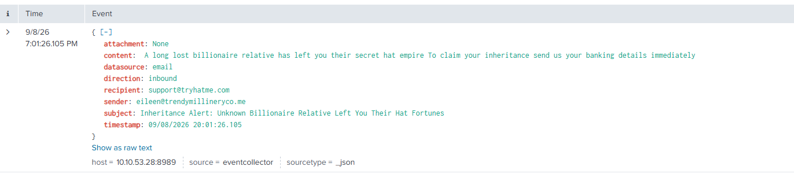

**Inbound and outbound email search — captured 2026-09-08 21:07:02**

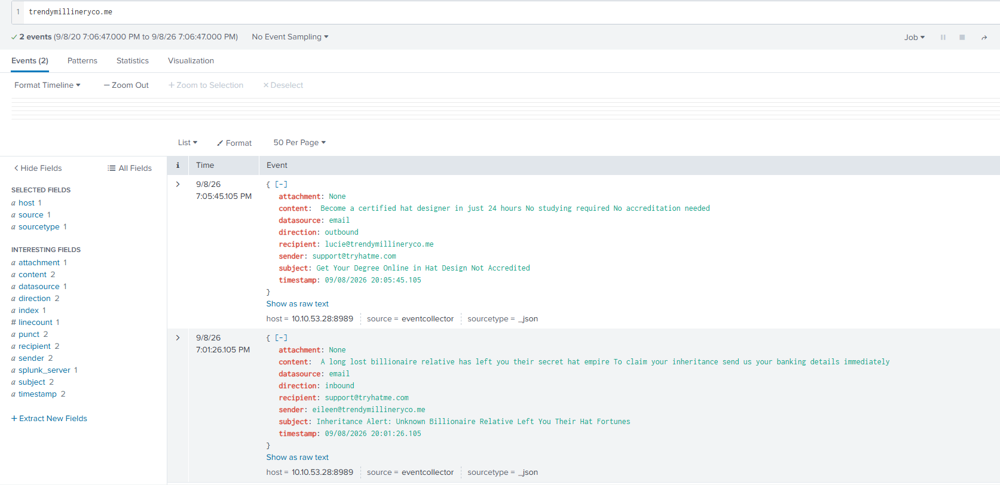

**Domain reputation check — captured 2026-09-08 21:08:48**

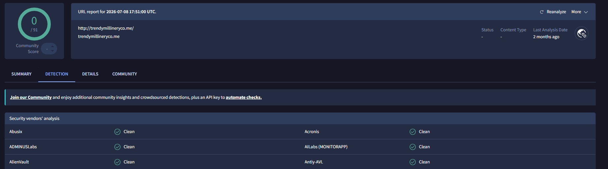

**Case-report form; not independent proof — captured 2026-09-08 21:09:59**

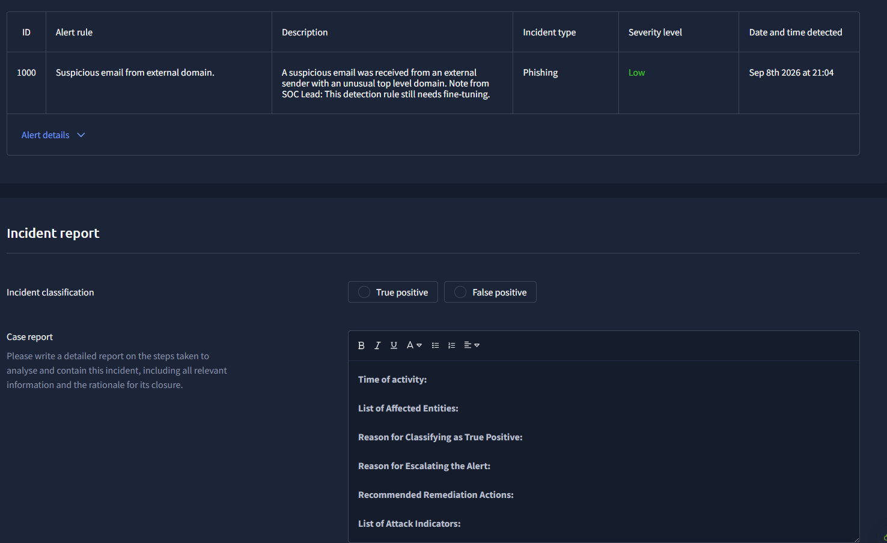

**SIEM copy of the inbound message — captured 2026-09-12 22:09:07**

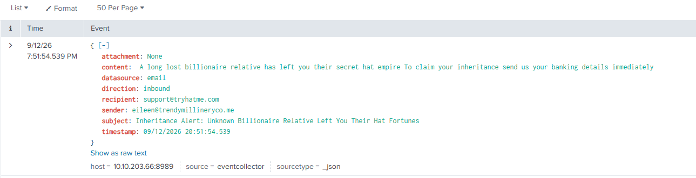

**SIEM sender-domain search — captured 2026-09-12 22:09:47**

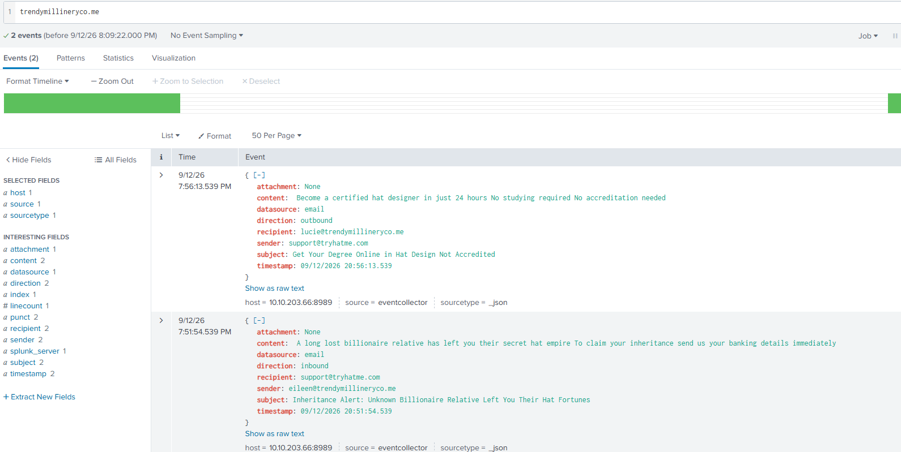

#### True Positive — SOC analysis

**Time of activity:** I recorded the inbound email event at **2026-09-08 20:01:39.105**. The same-day SIEM search also shows a separate outbound message involving the sender domain at 20:05:45.105; I did not treat that message as a reply to this lure.

**List of Affected Entities:** I identified `support@tryhatme.com` as the recipient and `eileen@trendymillineryco.me` as the sender. I found no affected endpoint or confirmed credential disclosure in these records.

**Reason for Classifying as True Positive:** I classified the email as a true-positive **phishing attempt** because the inheritance story explicitly asks the recipient to send banking details. The absence of an attachment and the domain's zero-vendor reputation result do not neutralize that request; I found no evidence that the recipient complied.

**Reason for Escalating the Alert:** I would route the message to the email-security queue because it solicits financial information and reached a shared support mailbox. I would escalate to an account-compromise incident only if mailbox, response, or sign-in evidence showed interaction.

**Recommended Remediation Actions:** I would preserve the message and headers, search for the same lure across mailboxes, remove matching messages after validation, and review any replies or account access by the recipient. I would block the sender or domain only after checking legitimate mail dependencies.

**List of Attack Indicators:** I would hunt for `eileen@trendymillineryco.me`, the subject `Inheritance Alert: Unknown Billionaire Relative Left You Their Hat Fortunes`, and requests to provide banking details. These are message-level pivots, not proof that the whole domain is malicious.

### Alert 1001 — TrustedInstaller parent-child relationship

**Finding:** On `win-3459`, `services.exe` starts `TrustedInstaller.exe` from the expected Windows servicing path. The analyst report records a false-positive rationale after checking the process context.

**Evidence**

**Alert detail — captured 2026-09-08 21:13:42**

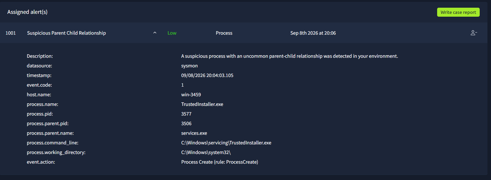

**Sysmon process event — captured 2026-09-08 21:14:35**

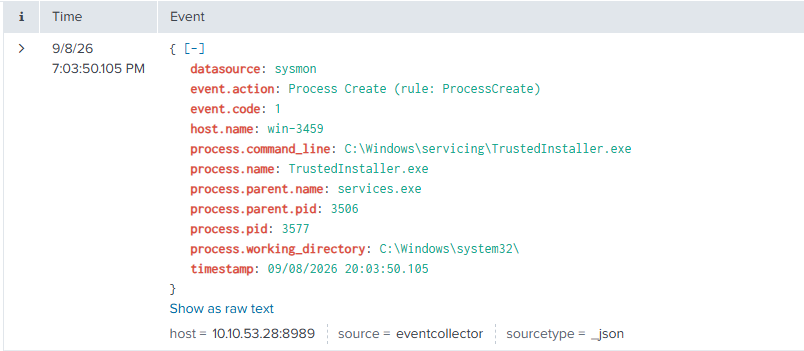

**Parent PID search — captured 2026-09-08 21:15:58**

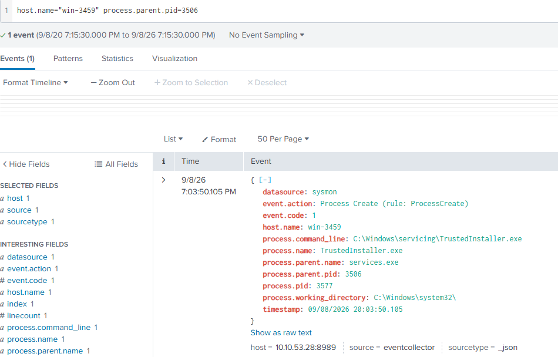

**Analyst false-positive report — captured 2026-09-08 21:19:05**

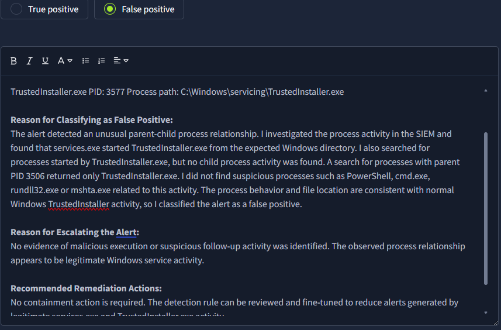

**SIEM TrustedInstaller search — captured 2026-09-12 22:11:33**

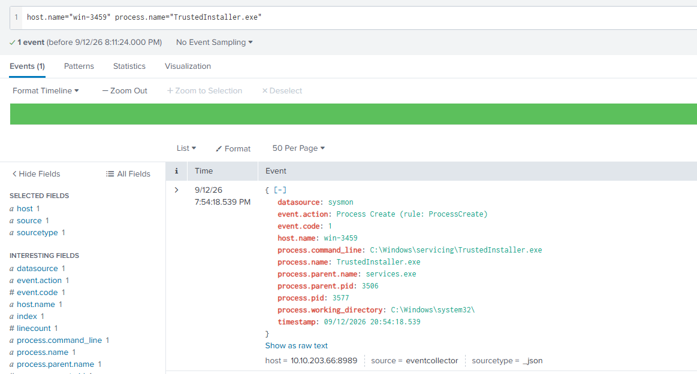

#### False Positive — SOC analysis

**Time of Activity:** I recorded the Sysmon process-creation event at **2026-09-08 20:04:03.105**.

**List of Related Entities:** I reviewed `win-3459`, `services.exe` (parent PID 3506), and `TrustedInstaller.exe` (PID 3577) in `C:\Windows\servicing`.

**Reason for Classifying as False Positive:** I checked the parent PID and process path in the SIEM. The observed service launch matches Windows servicing, and the supplied search shows no suspicious child process. I therefore classified the parent-child alert as a false positive; the captured analyst form reaches the same conclusion.

### Alert 1002 — taskhostw.exe KEYROAMING

**Finding:** `svchost.exe` starts `taskhostw.exe KEYROAMING` on `win-3451`; the SIEM returns the matching event.

**Evidence**

**Alert detail — captured 2026-09-08 21:20:18**

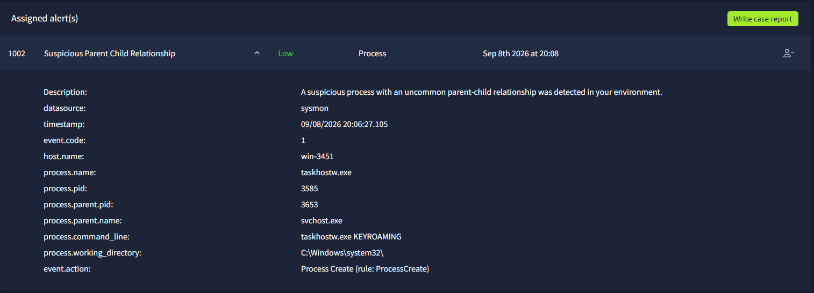

**SIEM taskhostw events on win-3451 — captured 2026-09-12 22:12:22**

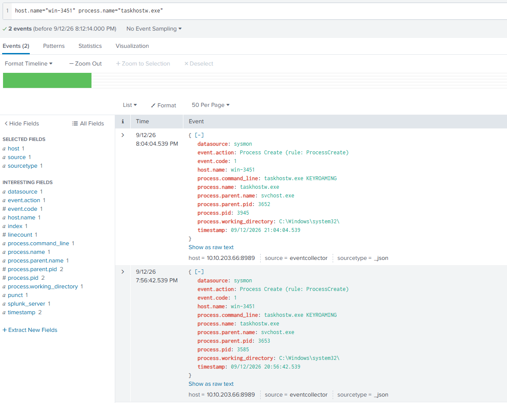

#### False Positive — SOC analysis

**Time of Activity:** I recorded the Sysmon process-creation event at **2026-09-08 20:06:27.105**.

**List of Related Entities:** I reviewed `win-3451`, `svchost.exe` (parent PID 3653), and `taskhostw.exe KEYROAMING` (PID 3585). No affected user or account is identified by this event.

**Reason for Classifying as False Positive:** I matched the alert to the SIEM event and found only the `KEYROAMING` taskhost invocation in the displayed context. I found no malicious child process, unusual path, or related activity, so I classify this detection as a false positive on the available evidence.

### Alert 1003 — External-domain email to yani.zubair

**Finding:** The message from `fashionindustrytrends.xyz` is an inbound hat-marketing email without an attachment. A later SIEM search finds the same sender; the domain reputation view is mixed and not conclusive.

**Evidence**

**Alert detail — captured 2026-09-08 21:20:50**

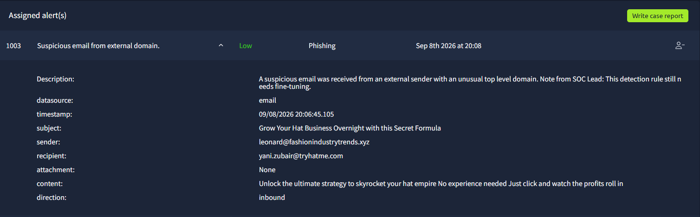

**SIEM sender search — captured 2026-09-12 22:13:20**

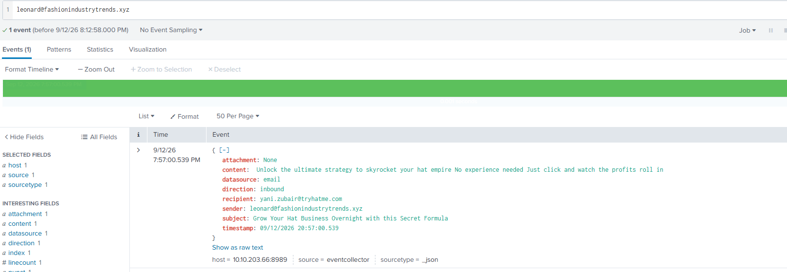

**Shared domain reputation context — captured 2026-09-12 22:16:17**

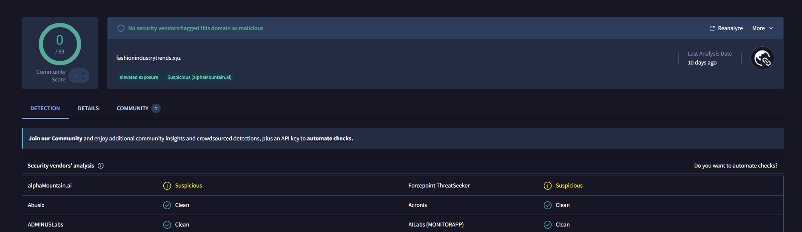

#### False Positive — SOC analysis

**Time of Activity:** I recorded the inbound email event at **2026-09-08 20:06:45.105**.

**List of Related Entities:** I reviewed `yani.zubair@tryhatme.com`, sender `leonard@fashionindustrytrends.xyz`, and the recipient mailbox. The record does not identify an affected endpoint.

**Reason for Classifying as False Positive:** I found a promotional message with no attachment. The copy says to click, but the supplied record shows no URL, click, credential request, or host follow-on. The shared reputation check is mixed and cannot establish this message as malicious, so I classify the phishing alert as a false positive while retaining it as unwanted-mail context.

### Alert 1004 — External-domain email to kyra.flores

**Finding:** A second inbound message from `fashionindustrytrends.xyz` has no attachment. The SIEM view includes this mail and outbound messages involving the same domain.

**Evidence**

**Alert detail — captured 2026-09-08 21:21:11**

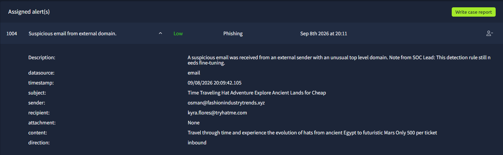

**Inbound message in SIEM results — captured 2026-09-12 22:14:10**

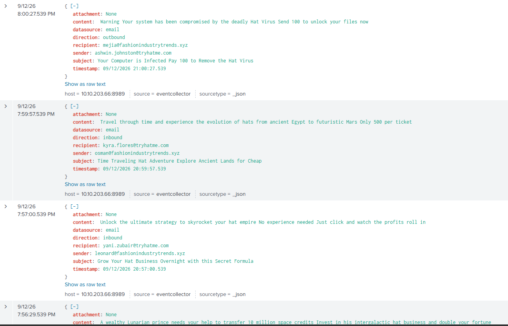

**Outbound mail context — captured 2026-09-12 22:14:24**

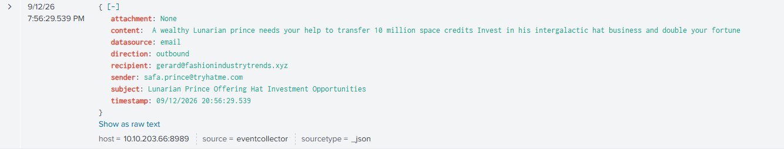

**Shared domain reputation context — captured 2026-09-12 22:16:17**

#### False Positive — SOC analysis

**Time of Activity:** I recorded the inbound email event at **2026-09-08 20:09:42.105**.

**List of Related Entities:** I reviewed `kyra.flores@tryhatme.com`, sender `osman@fashionindustrytrends.xyz`, and the recipient mailbox. Other outbound messages to the same domain are separate records and are not attributed to Kyra by these screenshots.

**Reason for Classifying as False Positive:** I found an implausible travel promotion without an attachment or a visible malicious URL. I found no recipient interaction or endpoint effect; unrelated outbound mail to the domain does not prove that this recipient responded. I classify this alert as a false positive for a confirmed phishing incident.

### Alert 1005 — Suspicious invoice attachment

**Finding:** An urgent overdue-payment email to `michael.ascot@tryhatme.com` includes an invoice-themed ZIP. SIEM searches recover the email event and Outlook-related `.eml` activity.

**Evidence**

**Alert detail and attachment — captured 2026-09-08 21:21:30**

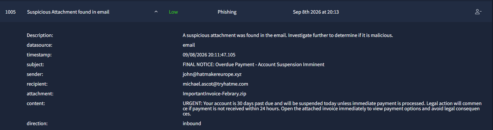

**Email event and attachment — captured 2026-09-12 22:17:02**

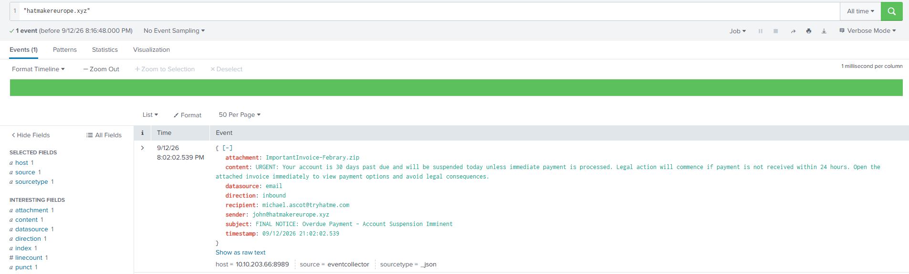

**Outlook and cached email activity — captured 2026-09-12 22:20:00**

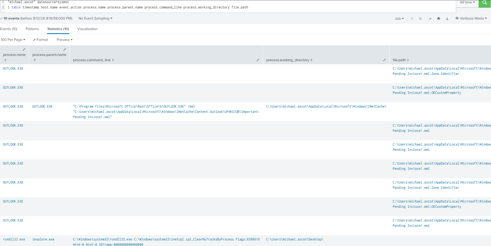

**Attachment-name search — captured 2026-09-12 22:20:57**

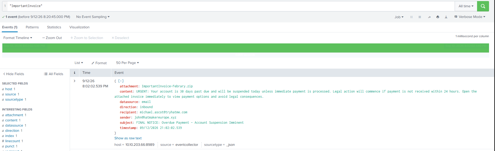

#### True Positive — SOC analysis

**Time of activity:** I recorded the alert-card email event at **2026-09-08 20:11:47.105**. A separate 12 September SIEM capture shows the same sender and attachment pattern at 21:02:02.539; I did not merge the two event times into one incident timeline.

**List of Affected Entities:** I identified `michael.ascot@tryhatme.com` as the recipient, `john@hatmakereurope.xyz` as the sender, and the recipient mailbox as exposed. The `win-3450` endpoint warrants a separate pivot, but the screenshots do not tie its later activity to this specific ZIP.

**Reason for Classifying as True Positive:** I classified the **delivery attempt** as true positive because the message pressures the recipient with account suspension and legal action while directing them to open `ImportantInvoice-Febrary.zip`. I found the attachment in the mail event, but I could not verify its contents, execution, or a causal link to later PowerShell activity.

**Reason for Escalating the Alert:** I would escalate to email security and endpoint triage because an unsolicited ZIP and urgent payment pretext reached the user associated with the suspicious host sequence. I would state the attachment-to-execution link as unconfirmed.

**Recommended Remediation Actions:** I would preserve the message and ZIP for safe analysis, remove matching messages, search for the attachment name and sender across recipients, and review Michael's file-open, process, and sign-in telemetry. I would contain the host if the related endpoint activity were confirmed in the same case.

**List of Attack Indicators:** I would use `john@hatmakereurope.xyz`, `ImportantInvoice-Febrary.zip`, and the subject `FINAL NOTICE: Overdue Payment - Account Suspension Imminent` as email hunting pivots; the attachment hash is unavailable.

### Alert 1006 — rdpclip.exe on win-3450

**Finding:** `svchost.exe` starts `rdpclip.exe` on `win-3450`. One broader host view includes other Sysmon activity; a targeted search confirms the `rdpclip.exe` event.

**Evidence**

**Alert detail — captured 2026-09-08 21:21:50**

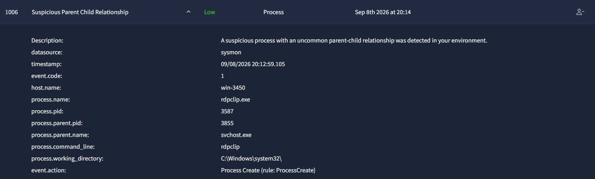

**Broader host event context — captured 2026-09-12 22:05:51**

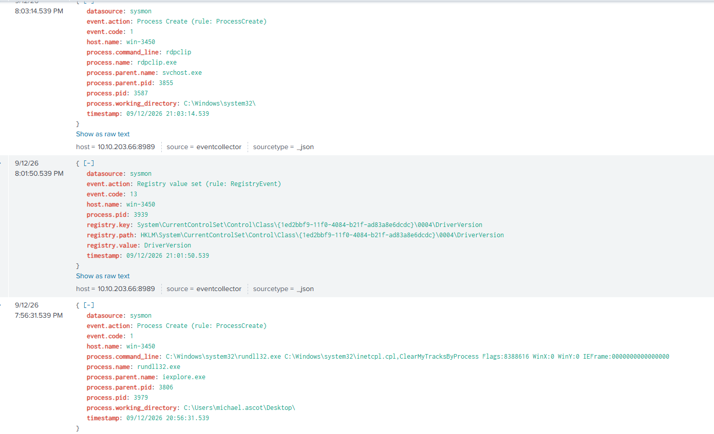

**Targeted rdpclip.exe search — captured 2026-09-12 22:34:51**

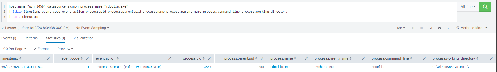

#### False Positive — SOC analysis

**Time of Activity:** I recorded the Sysmon process-creation event at **2026-09-08 20:12:59.105**.

**List of Related Entities:** I reviewed `win-3450`, `svchost.exe` (parent PID 3855), and `rdpclip.exe` (PID 3587). No user is identified in this process alert.

**Reason for Classifying as False Positive:** I found a clipboard-process launch under a Windows service parent and no malicious command line in this alert. I did not use the later suspicious activity on `win-3450` to retroactively label this isolated `rdpclip.exe` event malicious, so I classify this alert as a false positive.

### Alert 1007 — Second taskhostw.exe KEYROAMING event

**Finding:** Another `taskhostw.exe KEYROAMING` event appears on `win-3451`, again under `svchost.exe`. The shared SIEM search shows both taskhostw events.

**Evidence**

**Alert detail — captured 2026-09-08 21:22:10**

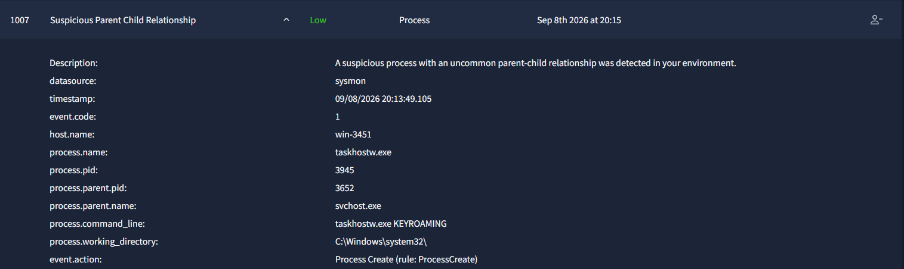

**SIEM taskhostw events on win-3451 — captured 2026-09-12 22:12:22**

#### False Positive — SOC analysis

**Time of Activity:** I recorded the Sysmon process-creation event at **2026-09-08 20:13:49.105**.

**List of Related Entities:** I reviewed `win-3451`, `svchost.exe` (parent PID 3652), and `taskhostw.exe KEYROAMING` (PID 3945). This is a separate process event from Alert 1002.

**Reason for Classifying as False Positive:** I compared the command line with the earlier `KEYROAMING` event and found the same routine pattern, with no suspicious child process or related compromise evidence in the supplied results. I classify the parent-child rule hit as a false positive.

### Alert 1008 — WUDFHost.exe on win-3455

**Finding:** `services.exe` starts `WUDFHost.exe` from `C:\Windows\System32` with UMDF host parameters. The SIEM view shows the corresponding event.

**Evidence**

**Alert detail — captured 2026-09-08 21:22:31**

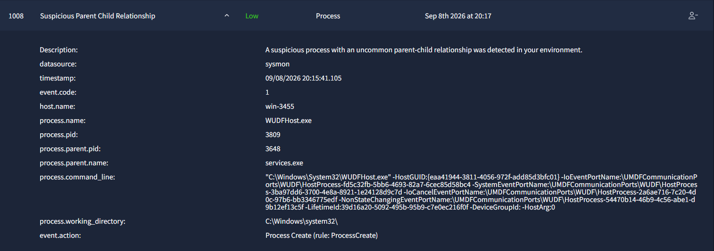

**Shared WUDFHost.exe SIEM search — captured 2026-09-12 22:36:00**

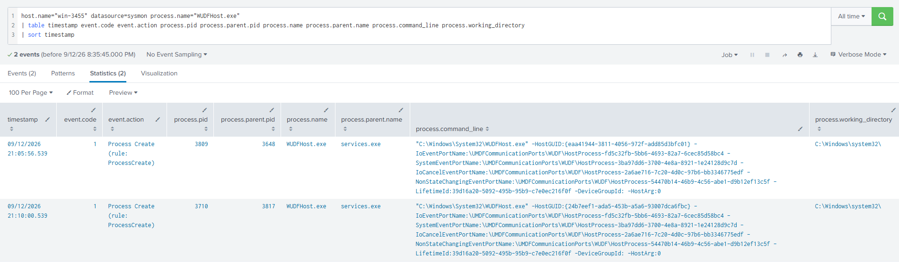

#### False Positive — SOC analysis

**Time of Activity:** I recorded the Sysmon process-creation event at **2026-09-08 20:15:41.105**.

**List of Related Entities:** I reviewed `win-3455`, `services.exe` (parent PID 3648), and `C:\Windows\System32\WUDFHost.exe` (PID 3809).

**Reason for Classifying as False Positive:** I checked the parent, System32 path, and UMDF host parameters against the SIEM record. The screenshots show Windows driver-host behavior and no abnormal child or path, so I classify this rule hit as a false positive.

### Alert 1009 — rdpclip.exe on win-3453

**Finding:** A separate `rdpclip.exe` process is recorded under `svchost.exe` on `win-3453` and confirmed by a targeted SIEM search.

**Evidence**

**Alert detail — captured 2026-09-08 21:22:54**

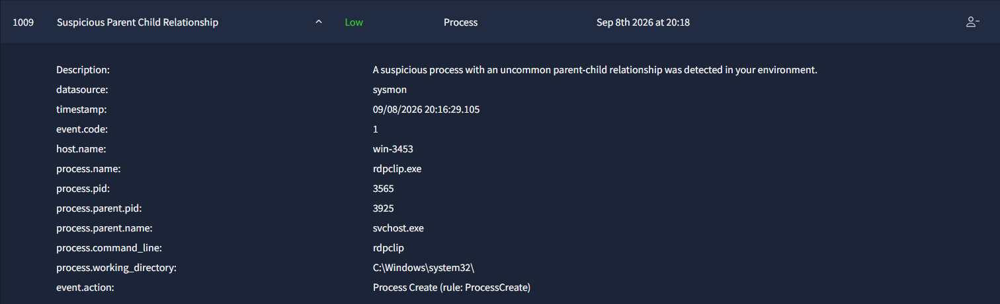

**Targeted rdpclip.exe search — captured 2026-09-12 22:36:45**

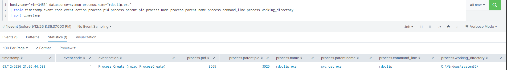

#### False Positive — SOC analysis

**Time of Activity:** I recorded the Sysmon process-creation event at **2026-09-08 20:16:29.105**.

**List of Related Entities:** I reviewed `win-3453`, `svchost.exe` (parent PID 3925), and `rdpclip.exe` (PID 3565).

**Reason for Classifying as False Positive:** I confirmed the event in a targeted SIEM search. The alert shows only a normal-looking clipboard process invocation; I found no suspicious ancestry, command, or related activity in the available evidence. I classify this alert as a false positive.

### Alert 1010 — Second WUDFHost.exe event

**Finding:** A second `WUDFHost.exe` process on `win-3455` is shown with Windows UMDF host parameters. The shared SIEM search contains both WUDFHost events.

**Evidence**

**Alert detail — captured 2026-09-08 21:23:22**

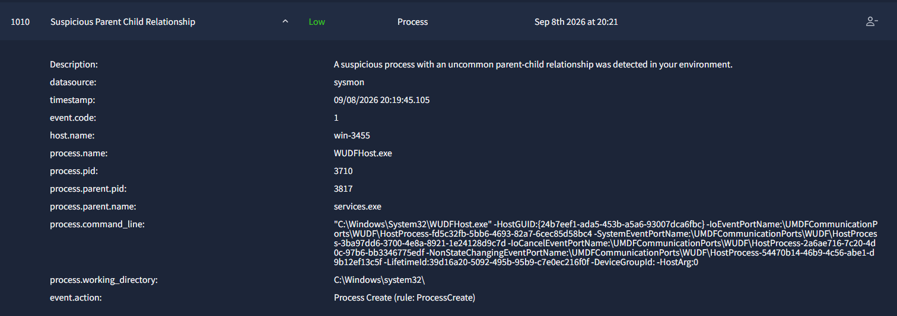

**Shared WUDFHost.exe SIEM search — captured 2026-09-12 22:36:00**

#### False Positive — SOC analysis

**Time of Activity:** I recorded the Sysmon process-creation event at **2026-09-08 20:19:45.105**.

**List of Related Entities:** I reviewed `win-3455`, `services.exe` (parent PID 3817), and `C:\Windows\System32\WUDFHost.exe` (PID 3710).

**Reason for Classifying as False Positive:** I compared this second UMDF host launch with Alert 1008 and the shared SIEM search. The parent, path, and host parameters are consistent with Windows driver activity, with no suspicious follow-on shown. I classify it as a false positive.

### Alert 1011 — External-domain marketing email

**Finding:** An inbound message from `modernmillinerygroup.online` to `michael.ascot` advertises hat-enhancement pills and has no attachment; SIEM shows the corresponding message.

**Evidence**

**Alert detail — captured 2026-09-08 21:25:24**

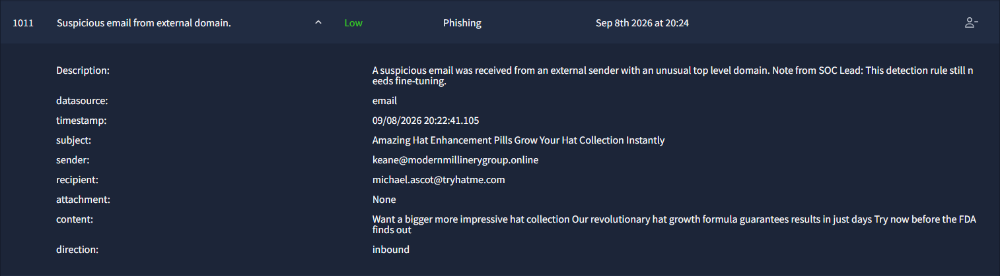

**SIEM sender-domain search — captured 2026-09-12 22:37:38**

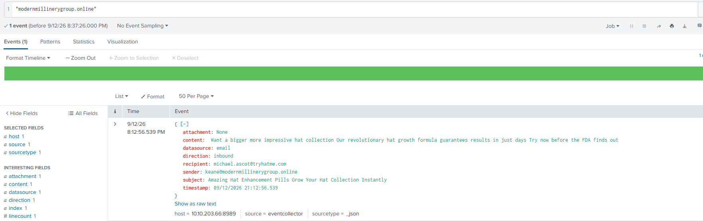

#### False Positive — SOC analysis

**Time of Activity:** I recorded the inbound email event at **2026-09-08 20:22:41.105**.

**List of Related Entities:** I reviewed recipient `michael.ascot@tryhatme.com`, sender `keane@modernmillinerygroup.online`, and the recipient mailbox. The event does not identify an affected host.

**Reason for Classifying as False Positive:** I found an unsolicited product advertisement with no attachment or visible credential request. I found no click, response, or endpoint link in the supplied evidence, so I classify this phishing-rule hit as a false positive and retain the email as spam context.

### Alert 1012 — svchost.exe wsapp process

**Finding:** `services.exe` starts `svchost.exe -k wsapp -p` on `win-3459`. A targeted SIEM search confirms the same command line.

**Evidence**

**Alert detail — captured 2026-09-08 21:28:48**

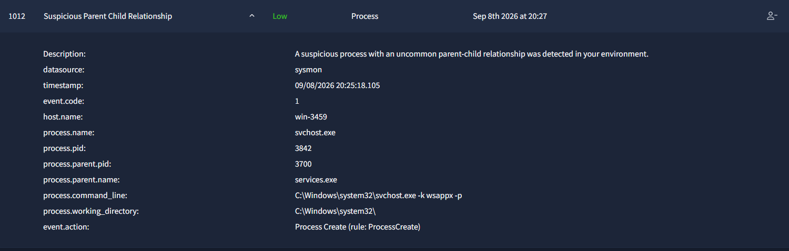

**Targeted svchost.exe search — captured 2026-09-12 22:38:34**

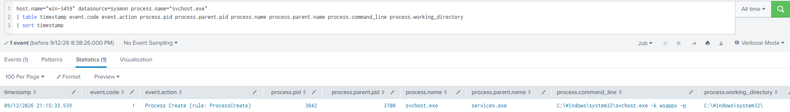

#### False Positive — SOC analysis

**Time of Activity:** I recorded the Sysmon process-creation event at **2026-09-08 20:25:18.105**.

**List of Related Entities:** I reviewed `win-3459`, `services.exe` (parent PID 3700), and `C:\Windows\system32\svchost.exe -k wsapp -p` (PID 3842).

**Reason for Classifying as False Positive:** I matched the service-host command line in the targeted SIEM search and found no malicious child, unusual directory, or related activity in the screenshots. I classify this parent-child alert as a false positive.

### Alert 1013 — Work-from-home scam email

**Finding:** The alert describes an inbound work-from-home offer from `hatventuresworldwide.online`. A later SIEM view shows the corresponding message.

**Evidence**

**Alert detail — captured 2026-09-08 21:31:26**

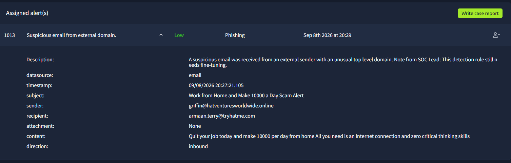

**Shared email search results — captured 2026-09-12 22:39:36**

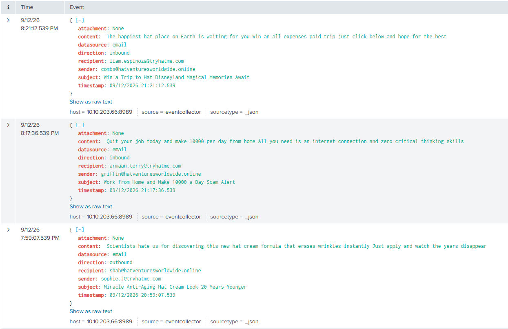

#### False Positive — SOC analysis

**Time of Activity:** I recorded the inbound email event at **2026-09-08 20:27:21.105**. A separate 12 September SIEM screenshot shows the same offer pattern at 21:17:36.539.

**List of Related Entities:** I reviewed recipient `armaan.terry@tryhatme.com`, sender `griffin@hatventuresworldwide.online`, and the recipient mailbox. No affected endpoint is identified.

**Reason for Classifying as False Positive:** I found an implausible work-from-home offer, but the supplied record contains no attachment, destination URL, request for money or credentials, response, or endpoint follow-on. I classify this as a false positive for a confirmed phishing incident while retaining the message as suspicious spam.

### Alert 1014 — Bulk-hat offer email

**Finding:** An inbound bulk-hat offer from a Gmail sender has no attachment. The SIEM result reproduces the message to `liam.espinoza`.

**Evidence**

**Alert detail — captured 2026-09-08 21:33:21**

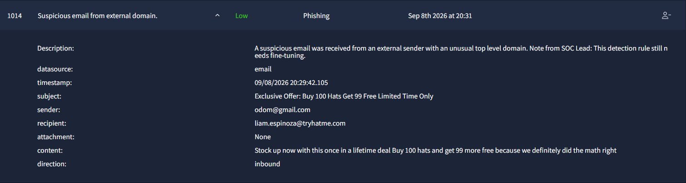

**SIEM sender search — captured 2026-09-12 22:40:36**

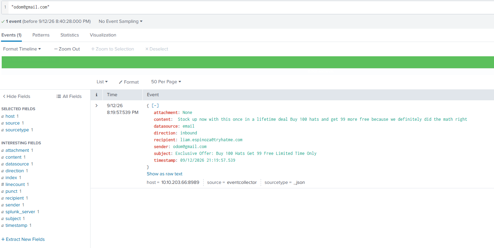

#### False Positive — SOC analysis

**Time of Activity:** I recorded the inbound email event at **2026-09-08 20:29:42.105**.

**List of Related Entities:** I reviewed `liam.espinoza@tryhatme.com`, sender `odom@gmail.com`, and the recipient mailbox.

**Reason for Classifying as False Positive:** I found a bulk-hat promotion with no attachment, visible link, credential request, or associated endpoint activity. The sender's common mail domain is not itself an attack indicator. I classify this phishing alert as a false positive on the provided record.

### Alert 1015 — TrustedInstaller.exe on win-3449

**Finding:** `services.exe` starts `TrustedInstaller.exe` from the Windows servicing path on another host; SIEM confirms the process event.

**Evidence**

**Alert detail — captured 2026-09-08 21:35:37**

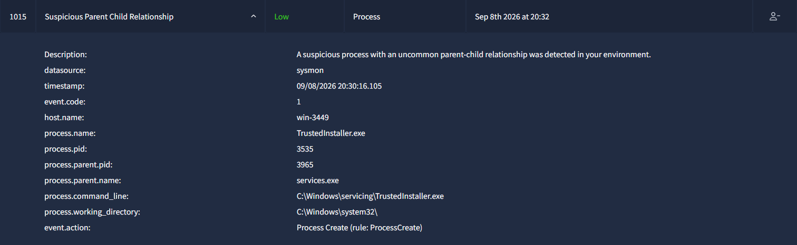

**Targeted TrustedInstaller.exe search — captured 2026-09-12 22:41:25**

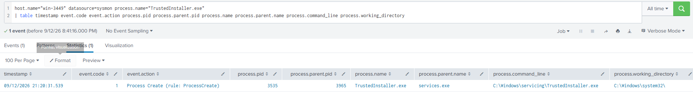

#### False Positive — SOC analysis

**Time of Activity:** I recorded the Sysmon process-creation event at **2026-09-08 20:30:16.105**.

**List of Related Entities:** I reviewed `win-3449`, `services.exe` (parent PID 3965), and `C:\Windows\servicing\TrustedInstaller.exe` (PID 3535).

**Reason for Classifying as False Positive:** I matched the path and service parent to the same servicing pattern examined in Alert 1001. The supplied SIEM result does not show suspicious descendants or an unexpected path. I classify this process-rule hit as a false positive.

### Alert 1016 — taskhostw.exe NGCKEYPREGEN

**Finding:** On `win-3456`, `taskhostw.exe NGCKEYPREGEN` runs under `svchost.exe`; SIEM returns the matching process record.

**Evidence**

**Alert detail — captured 2026-09-08 21:35:20**

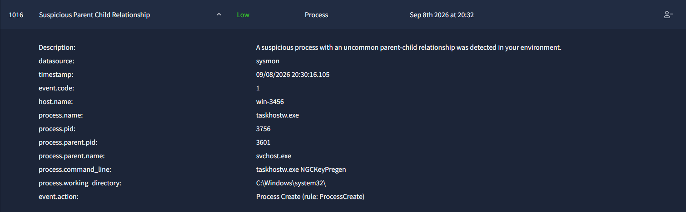

**Targeted taskhostw.exe search — captured 2026-09-12 22:42:07**

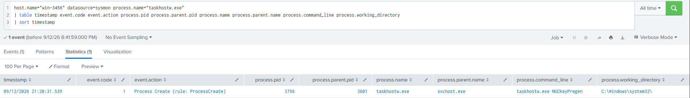

#### False Positive — SOC analysis

**Time of Activity:** I recorded the Sysmon process-creation event at **2026-09-08 20:30:16.105**.

**List of Related Entities:** I reviewed `win-3456`, `svchost.exe` (parent PID 3601), and `taskhostw.exe NGCKeyPregen` (PID 3756).

**Reason for Classifying as False Positive:** I matched the alert to the SIEM process record. The `NGCKeyPregen` taskhost parameter and service parent have no malicious follow-on in the screenshots, so I classify the parent-child rule hit as a false positive.

### Alert 1017 — Another fashionindustrytrends.xyz email

**Finding:** The alert shows another no-attachment message from `fashionindustrytrends.xyz`. The domain reputation view provides shared context for Alerts 1003, 1004, and 1017.

**Evidence**

**Alert detail — captured 2026-09-08 21:34:46**

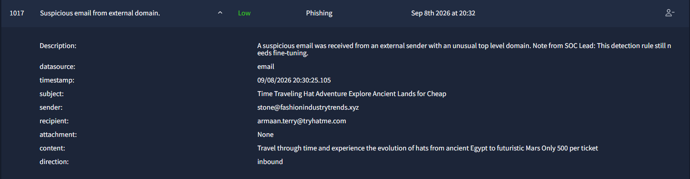

**Shared domain reputation context — captured 2026-09-12 22:16:17**

#### False Positive — SOC analysis

**Time of Activity:** I recorded the inbound email event at **2026-09-08 20:30:25.105**.

**List of Related Entities:** I reviewed `armaan.terry@tryhatme.com`, sender `stone@fashionindustrytrends.xyz`, and the recipient mailbox.

**Reason for Classifying as False Positive:** I found another travel offer with no attachment, visible malicious URL, response, or endpoint effect. The domain reputation image is a shared lead but does not verify this individual message as phishing. I classify this alert as a false positive for a confirmed threat.

### Alert 1018 — Prize-themed external email

**Finding:** A hat-themed prize message from `hatventuresworldwide.online` to `liam.espinoza` has no attachment. The same message is visible in the SIEM search results.

**Evidence**

**Alert detail — captured 2026-09-08 21:33:54**

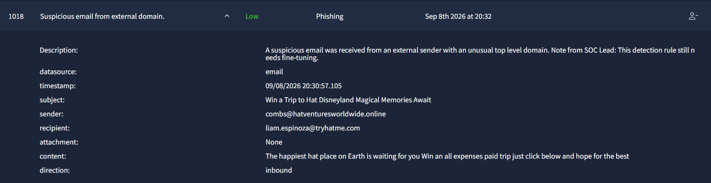

**Shared email search results — captured 2026-09-12 22:39:36**

#### False Positive — SOC analysis

**Time of Activity:** I recorded the inbound email event at **2026-09-08 20:30:57.105**. A separate 12 September SIEM event shows the same prize theme at 21:21:12.539.

**List of Related Entities:** I reviewed recipient `liam.espinoza@tryhatme.com`, sender `combs@hatventuresworldwide.online`, and the recipient mailbox. No affected endpoint is identified.

**Reason for Classifying as False Positive:** I found a prize-themed message that says to click, but the screenshot shows no destination URL, attachment, recipient click, credential request, or host activity. I classify this as a false positive for a verified phishing incident and retain it as unwanted-mail context.

### Alert 1019 — taskhostw.exe KEYROAMING on win-3460

**Finding:** `svchost.exe` starts `taskhostw.exe KEYROAMING` on `win-3460`. SIEM confirms the command line and parent.

**Evidence**

**Alert detail — captured 2026-09-08 21:34:17**

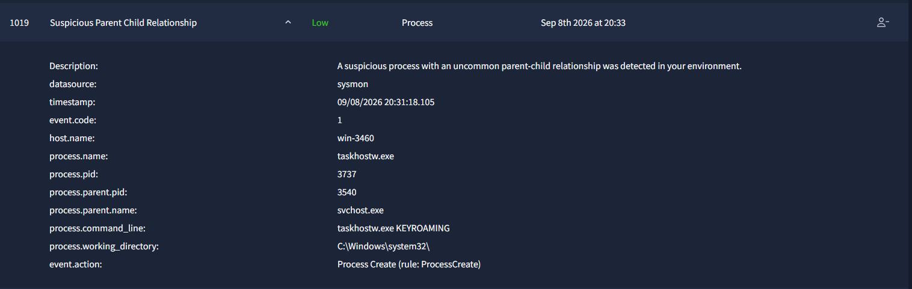

**Targeted taskhostw.exe search — captured 2026-09-12 22:42:51**

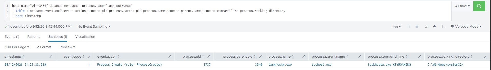

#### False Positive — SOC analysis

**Time of Activity:** I recorded the Sysmon process-creation event at **2026-09-08 20:31:18.105**.

**List of Related Entities:** I reviewed `win-3460`, `svchost.exe` (parent PID 3540), and `taskhostw.exe KEYROAMING` (PID 3737).

**Reason for Classifying as False Positive:** I matched the process record to the targeted SIEM result and compared it with the other `KEYROAMING` detections. I found no suspicious command or downstream activity specific to this host, so I classify the alert as a false positive.

### Alert 1020 — PowerView.ps1 created in Downloads

**Finding:** Sysmon records `PowerView.ps1` created by `powershell.exe` on `win-3450`. Searches around the same host show a PowerShell command referencing `powercat.ps1`, DNS activity, and discovery child processes.

**Evidence**

**Alert detail and file path — captured 2026-09-08 21:36:10**

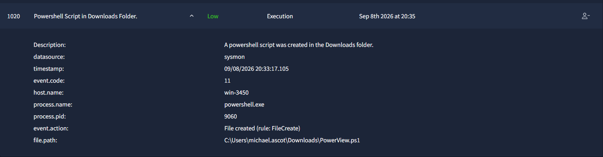

**Initial process and DNS search — captured 2026-09-12 22:22:46**

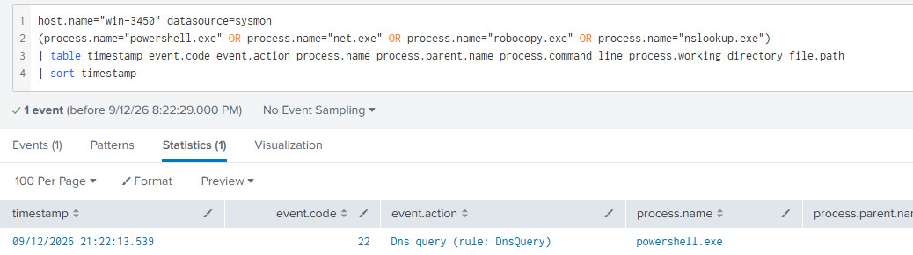

**PowerShell DNS events — captured 2026-09-12 22:23:30**

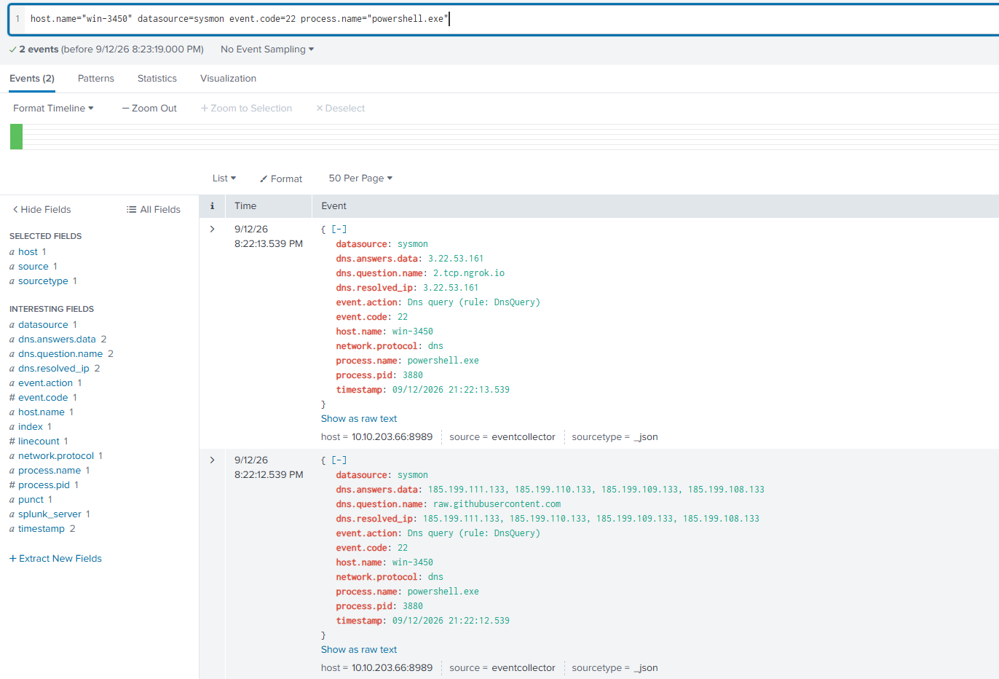

**PowerShell command and process timeline — captured 2026-09-12 22:30:44**

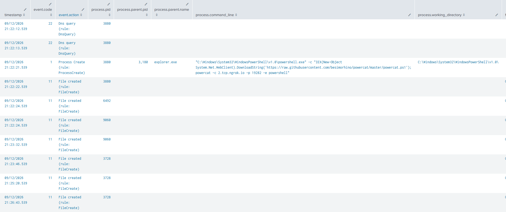

**PowerView.ps1 file-creation event — captured 2026-09-12 22:32:44**

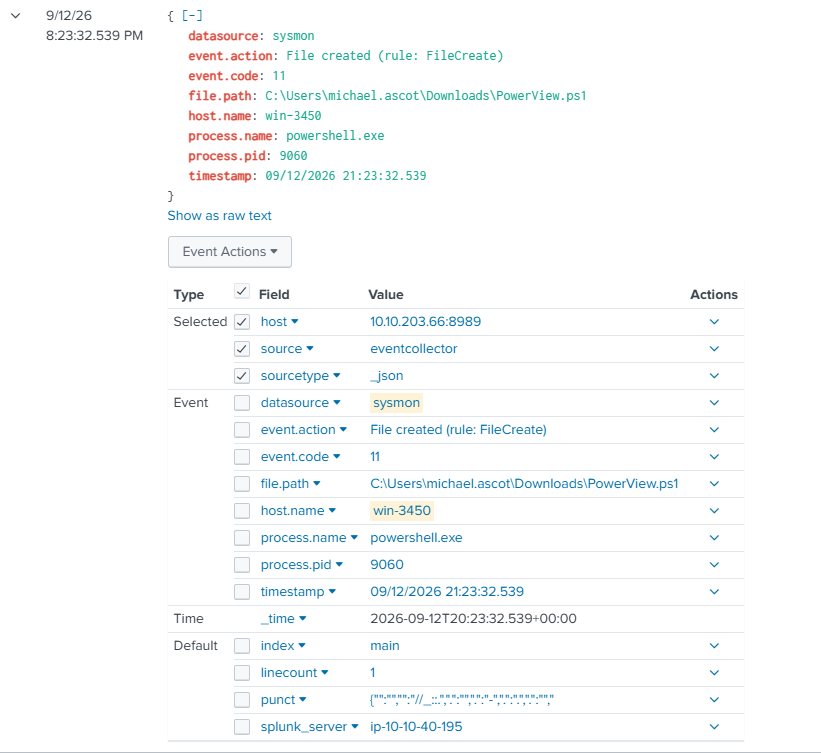

**PowerShell child processes and file activity — captured 2026-09-12 22:33:51**

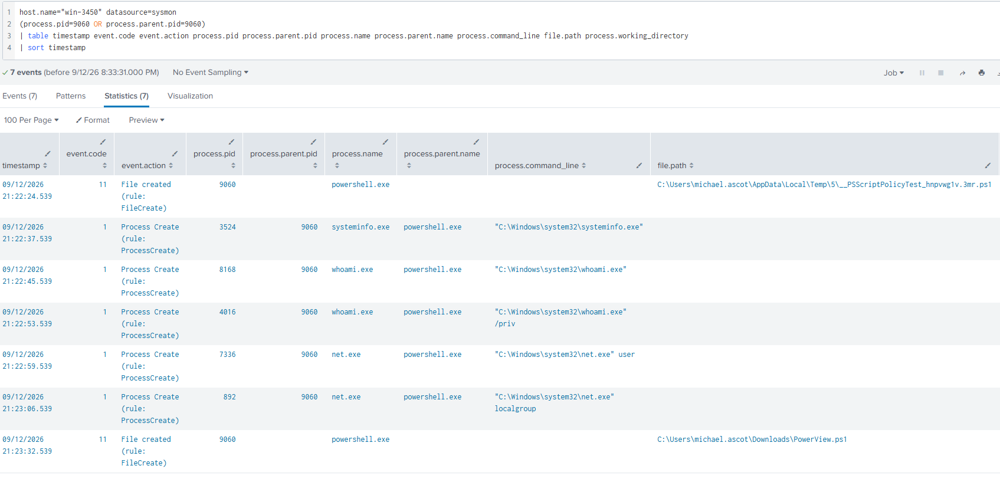

#### True Positive — SOC analysis

**Time of activity:** I recorded the Sysmon file-creation event at **2026-09-08 20:33:17.105**. Separately, the 12 September SIEM captures show PowerShell, discovery, and file activity around 21:22–21:23; those timestamps belong to that later event set.

**List of Affected Entities:** I identified `win-3450`, the `michael.ascot` profile, `powershell.exe` (PID 9060 in the alert), and `C:\Users\michael.ascot\Downloads\PowerView.ps1`.

**Reason for Classifying as True Positive:** I classified the alert as true positive because PowerShell created a reconnaissance script in the user's Downloads directory, and the related host investigation shows discovery commands plus a separate PowerShell command referencing `powercat.ps1`. The creation event does not prove that `PowerView.ps1` executed or that the remote relay connected.

**Reason for Escalating the Alert:** I would escalate this host to incident response because script staging and discovery precede the observed file-share, copying, and DNS sequence. I would preserve process ancestry and file contents before containment changes where possible.

**Recommended Remediation Actions:** I would isolate `win-3450` under the lab procedure, collect the script and PowerShell logs, hash and inspect the file, review process/network telemetry, and scope the same command patterns across hosts. I would review Michael's account activity before deciding on session revocation or credential rotation.

**List of Attack Indicators:** I would hunt for `C:\Users\michael.ascot\Downloads\PowerView.ps1`, `powercat.ps1`, PowerShell download-and-execute syntax, and the `2.tcp.ngrok.io` relay named in the separate SIEM command line. The relay host is shared infrastructure; an exact port and time are needed for correlation.

### Alert 1021 — taskhostw.exe KEYROAMING on win-3451

**Finding:** A later `taskhostw.exe KEYROAMING` event appears on `win-3451` and is confirmed by a targeted SIEM search.

**Evidence**

**Alert detail — captured 2026-09-08 21:37:29**

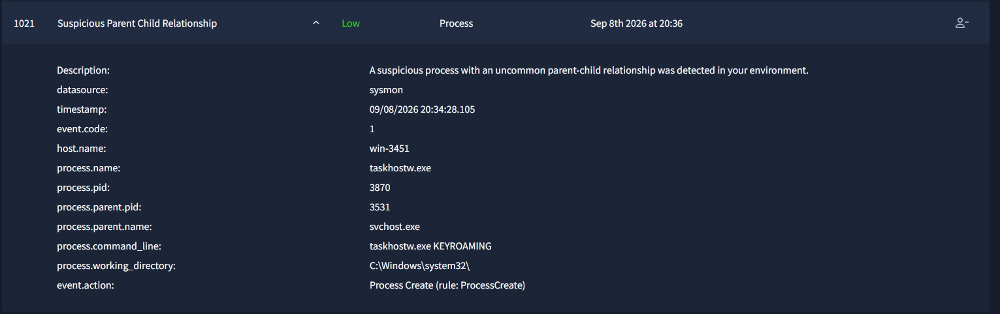

**Targeted taskhostw.exe search — captured 2026-09-12 22:43:31**

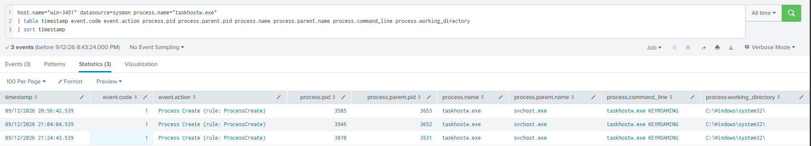

#### False Positive — SOC analysis

**Time of Activity:** I recorded the Sysmon process-creation event at **2026-09-08 20:34:28.105**.

**List of Related Entities:** I reviewed `win-3451`, `svchost.exe` (parent PID 3531), and `taskhostw.exe KEYROAMING` (PID 3870).

**Reason for Classifying as False Positive:** I confirmed a third `KEYROAMING` taskhost event on this host and found no malicious child process, unusual path, or host compromise evidence in the supplied search. I classify this rule hit as a false positive.

### Alert 1022 — Network share mapped to Z:

**Finding:** A PowerShell child process runs `net.exe use Z:` to map `\\FILESRV-01\SSF-FinancialRecords` on `win-3450`. The SIEM process table also shows the later copy and unmap events.

**Evidence**

**Alert detail and net use command — captured 2026-09-08 21:38:07**

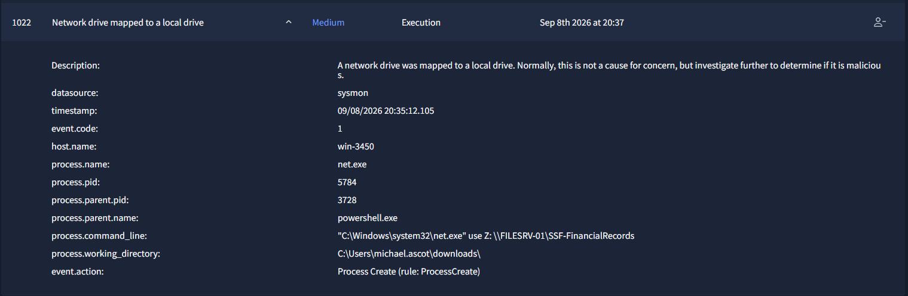

**Correlated share-map and copy timeline — captured 2026-09-12 22:27:50**

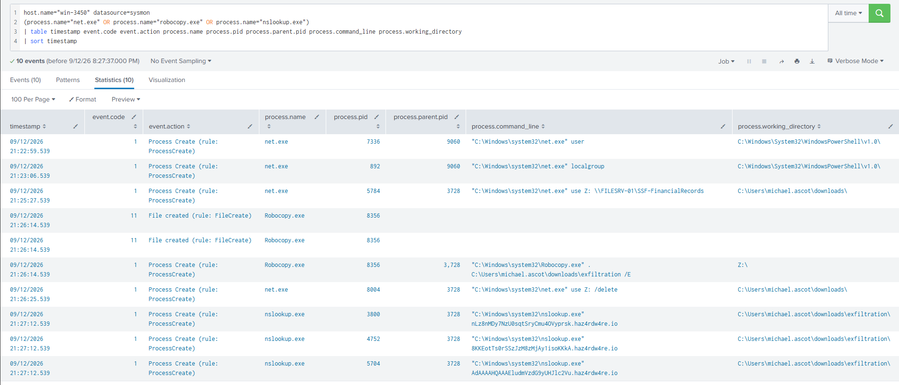

#### True Positive — SOC analysis

**Time of activity:** I recorded the share-mapping process event at **2026-09-08 20:35:12.105**. The analogous 12 September SIEM sequence shows a map at 21:25:27.539, followed by copying and unmapping.

**List of Affected Entities:** I identified `win-3450`, the `michael.ascot` profile, `powershell.exe` (parent PID 3728), drive `Z:`, and `\\FILESRV-01\SSF-FinancialRecords` as the source share. The file server is a potentially affected data source, not a proven compromised host.

**Reason for Classifying as True Positive:** I classified this event as true positive **in the correlated host sequence**: PowerShell launched `net.exe use Z:` to reach financial records, then the same parent launched copying and cleanup commands. A drive map alone could be normal, but this context supports collection activity.

**Reason for Escalating the Alert:** I would escalate with the endpoint incident because access to financial records raises potential data-exposure impact. I would ask the file-share owner to preserve access logs and identify the files read.

**Recommended Remediation Actions:** I would preserve SMB/share and authentication logs, confirm Michael's authorization, determine which files were accessed, and limit share access if the session was unauthorized. I would coordinate host isolation with the ongoing endpoint investigation.

**List of Attack Indicators:** I would correlate `net.exe use Z:`, `\\FILESRV-01\SSF-FinancialRecords`, `win-3450`, and the PowerShell parent process. The share path is a scoped investigative pivot, not a blocklist item.

### Alert 1023 — Robocopy from mapped share

**Finding:** `Robocopy.exe` runs with `Z:\` as its working directory and a local `downloads\exfiltration` destination. Additional file events show local staging and a ZIP file.

**Evidence**

**Alert detail and Robocopy command — captured 2026-09-08 21:38:42**

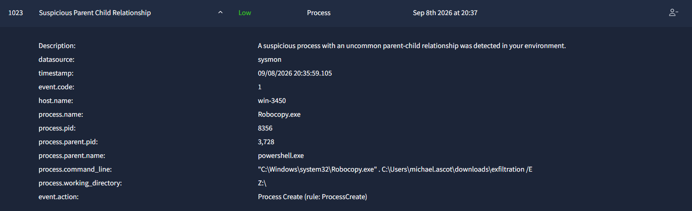

**Correlated Robocopy process table — captured 2026-09-12 22:27:50**

**Local staging and ZIP file events — captured 2026-09-12 22:31:32**

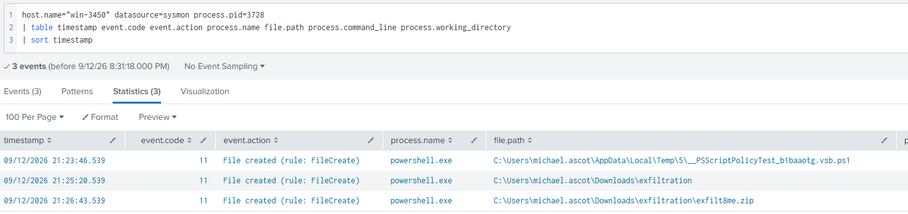

#### True Positive — SOC analysis

**Time of activity:** I recorded the Robocopy process event at **2026-09-08 20:35:59.105**. The separate 12 September SIEM sequence places a corresponding copy command at 21:26:14.539 and later local staging events.

**List of Affected Entities:** I identified `win-3450`, the `michael.ascot` profile, source drive `Z:` mapped to `\\FILESRV-01\SSF-FinancialRecords`, and `C:\Users\michael.ascot\downloads\exfiltration` as the local destination.

**Reason for Classifying as True Positive:** I classified this as true positive for **data collection/staging** because PowerShell launched `Robocopy.exe` from the mapped financial share into an `exfiltration` directory; the later SIEM file events show that directory and an `exfilt8me.zip` archive. I did not infer a successful external transfer from file staging alone.

**Reason for Escalating the Alert:** I would raise this to incident response and the data owner because a financial share was copied locally as part of the same suspicious command chain. I would flag possible exposure while keeping the amount and destination unconfirmed.

**Recommended Remediation Actions:** I would preserve the staging folder and archive, compare source and destination files and hashes, review share audit logs, and restrict unauthorized share access. I would retain DNS and proxy logs for the separate exfiltration assessment.

**List of Attack Indicators:** I would hunt for `Robocopy.exe` launched by PowerShell, working directory `Z:\`, `C:\Users\michael.ascot\downloads\exfiltration`, and `exfilt8me.zip` in the 12 September file events.

### Alert 1024 — Mapped drive disconnected

**Finding:** `net.exe use Z: /delete` runs after the map-and-copy sequence on `win-3450`; the SIEM timeline shows its place in the chain.

**Evidence**

**Alert detail and unmap command — captured 2026-09-08 21:39:25**

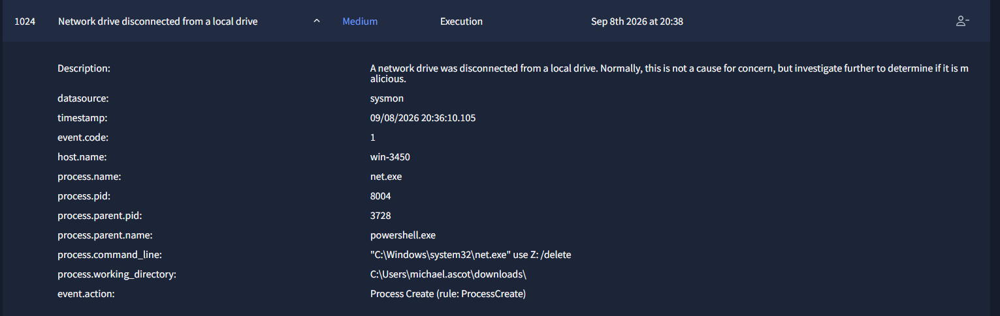

**Correlated drive-disconnect timeline — captured 2026-09-12 22:27:50**

#### True Positive — SOC analysis

**Time of activity:** I recorded the unmap process event at **2026-09-08 20:36:10.105**. A corresponding 12 September SIEM event follows the copy at 21:26:25.539.

**List of Affected Entities:** I identified `win-3450`, the `michael.ascot` profile, `powershell.exe` (parent PID 3728), `net.exe` (PID 8004), and mapped drive `Z:`.

**Reason for Classifying as True Positive:** I classified the alert as true positive **as part of the collection sequence** because the same PowerShell parent mapped the share, launched Robocopy, and then ran `net.exe use Z: /delete`. Unmapping by itself is routine; its timing and process ancestry give it investigative value here.

**Reason for Escalating the Alert:** I would attach this event to the existing endpoint and file-share incident as sequence evidence. I would not open a separate high-severity incident solely for the disconnect command.

**Recommended Remediation Actions:** I would preserve the process timeline and share-session logs, verify that the mapped connection has ended, and continue scoping files copied and accounts used. I would avoid broad blocking of normal `net.exe` usage.

**List of Attack Indicators:** I would correlate `net.exe use Z: /delete`, PowerShell parent PID 3728, the preceding `net.exe use Z:` command, and the Robocopy event on `win-3450`.

### Alert 1025 — Repeated nslookup from staging folder

**Finding:** `nslookup.exe` processes are launched by PowerShell from `downloads\exfiltration` with long labels under `haz4rdw4re.io`.

**Evidence**

**Alert detail and encoded-looking query — captured 2026-09-08 21:40:11**

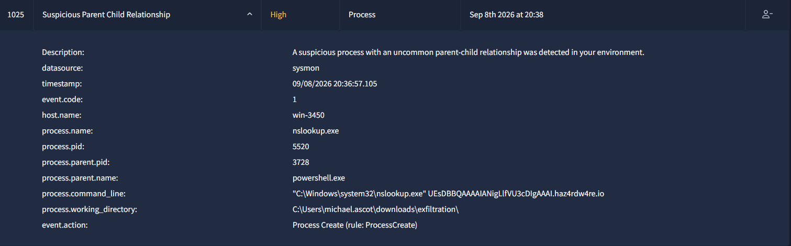

**Multiple nslookup process events — captured 2026-09-12 22:29:05**

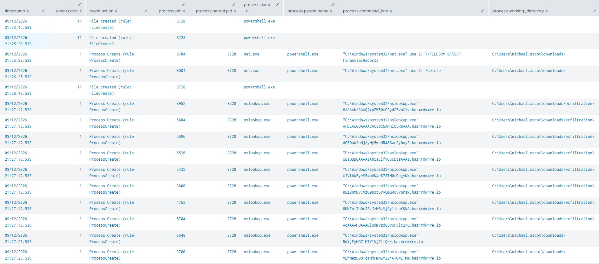

#### True Positive — SOC analysis

**Time of activity:** I recorded the alert-card `nslookup.exe` process event at **2026-09-08 20:36:57.105**. The 12 September SIEM view separately shows repeated lookups at 21:27:12.539 and 21:27:28.539.

**List of Affected Entities:** I identified `win-3450`, the `michael.ascot` profile, `powershell.exe` (parent PID 3728), `nslookup.exe`, the local `downloads\exfiltration` directory, and `haz4rdw4re.io` as the DNS suffix.

**Reason for Classifying as True Positive:** I classified this as true positive for **suspected DNS exfiltration activity** because PowerShell repeatedly launched `nslookup.exe` with long encoded-looking subdomains from the staging folder immediately after the share-copy sequence. Process creation proves attempted lookups, but the screenshots do not show DNS responses, bytes delivered, or the destination receiving data.

**Reason for Escalating the Alert:** I would escalate urgently to incident response and the financial-data owner because the queries may carry staged information out of the environment. I would describe data loss as possible, not confirmed.

**Recommended Remediation Actions:** I would isolate the endpoint, preserve DNS resolver and network logs, check whether the queries resolved and left the network, decode samples safely to assess content, and compare any data with the staged files. I would block or sinkhole the exact malicious destination after validation and scope other hosts for the same pattern.

**List of Attack Indicators:** I would hunt for repeated long labels under `haz4rdw4re.io`, `nslookup.exe` spawned by PowerShell, and working directory `C:\Users\michael.ascot\downloads\exfiltration`. The query labels are evidence of a pattern; no data volume is established.

## Observed sequence on 12 September

Times below are the event timestamps displayed in the screenshots, not the screenshot capture times.

| Lab event time | Observation | Supporting evidence |
| --- | --- | --- |
| 21:02 | An inbound, overdue-payment message carries the ZIP attachment. | [Email event](../evidence/phishing-unfolding/2026-09-12/221702.png) |
| Before 21:22 | The user context has Outlook activity involving a locally cached `.eml` file named like a pending invoice. This is a useful pivot, but the screenshot does not link that file conclusively to the ZIP attachment. | [Outlook and file events](../evidence/phishing-unfolding/2026-09-12/222000.png) |
| 21:22:21 | PowerShell starts with a command line that downloads `powercat.ps1` and specifies a remote relay. This is much stronger evidence than the email's appearance alone. | [Process timeline](../evidence/phishing-unfolding/2026-09-12/223044.png) |
| 21:22–21:23 | The same PowerShell process launches `systeminfo.exe`, `whoami.exe`, and `net.exe` queries; a `PowerView.ps1` file-creation event appears. These are consistent with discovery activity. | [Child-process and file events](../evidence/phishing-unfolding/2026-09-12/223351.png) |
| 21:25–21:26 | `net.exe` maps `Z:` to `\\FILESRV-01\SSF-FinancialRecords`. `Robocopy.exe` then copies from its `Z:\` working directory into a local `downloads\exfiltration` folder; the drive mapping is subsequently removed. | [Share and copy events](../evidence/phishing-unfolding/2026-09-12/222750.png) |
| 21:27 | Multiple `nslookup.exe` processes run from the local exfiltration folder with long subdomains under `haz4rdw4re.io`. The pattern is consistent with attempted DNS-based data transfer, although these images do not show transfer success or volume. | [Process table](../evidence/phishing-unfolding/2026-09-12/222905.png) |

The SIEM searches use `host.name`, `datasource=sysmon`, process names, parent PIDs, command lines, and file paths to connect events. The linked process tables are more reliable than treating every low-severity alert as a separate confirmed incident. [PowerShell and DNS pivot](../evidence/phishing-unfolding/2026-09-12/222330.png) · [Process ancestry](../evidence/phishing-unfolding/2026-09-12/223351.png)

## Assessment

The PowerShell command, reconnaissance child processes, mapped file share, local copying, and repeated encoded-looking DNS lookups form a coherent suspicious sequence on `win-3450`. This merits escalation as a **simulated true-positive endpoint incident** and investigation of possible data exposure. The visible `PowerView.ps1` and `powercat.ps1` references strengthen that assessment, but the source files, network payloads, and destination-side records are not available here.

The original screenshots do **not** establish:

- Whether the suspicious ZIP was opened or caused the later endpoint activity.
- Whether the remote relay connection was established.
- Whether the copied files were successfully sent over DNS or another channel.
- Whether containment, credential reset, or recovery was completed.

## Indicators and hunting pivots

These values come from the simulated evidence and should be interpreted in context. Shared services and common tools are not suitable for blanket blocking based on one screenshot.

| Type | Value or pattern | Use |
| --- | --- | --- |
| Sender domain | `hatmakereurope.xyz` | Find matching messages and recipients. |
| Attachment | Invoice-themed ZIP in the linked email event | Correlate email, download, and file events. |
| Endpoint | `win-3450` | Review process tree, file creation, authentication, and network telemetry. |
| Local staging path | `downloads\exfiltration` | Search file creation, copy, and archive activity. |
| File share | `\\FILESRV-01\SSF-FinancialRecords` | Review share access and affected files. |
| DNS pattern | Long labels under `haz4rdw4re.io` | Correlate DNS queries with process and network logs. |
| Tool references | `powercat.ps1`, `PowerView.ps1` | Check file hashes, acquisition, and execution details. |
| Remote relay | `2.tcp.ngrok.io` in the PowerShell command | Investigate the exact connection and timing; the hostname is shared infrastructure. |

## Recommended response and validation

1. Preserve the relevant email, endpoint, DNS, proxy, file-share, and authentication logs with their timestamps and time-zone context.
2. Isolate `win-3450` according to the lab response procedure and capture volatile evidence before changing the host, if still available.
3. Identify files read from `SSF-FinancialRecords`, compare their hashes to local staging files, and check network or DNS logs for confirmed outbound transfer.
4. Review the recipient account's recent sign-ins and access, then rotate credentials and revoke sessions if compromise is confirmed.
5. Hunt for the same sender, attachment, process command-line patterns, staging path, and DNS pattern across other hosts.
6. Tune the low-severity mail and process rules using validated false positives without suppressing the stronger correlated chain.

These are proposed actions derived from the screenshot evidence; the archive does not show that they were performed.

## Evidence inventory

All **65** source images are displayed inline: the scenario overview above, followed by the alert cards and their supporting evidence under each alert. Shared SIEM views may appear under more than one alert. The [screenshot index](../evidence/phishing-unfolding/README.md) provides timestamp-based navigation. The images were copied without editing.
