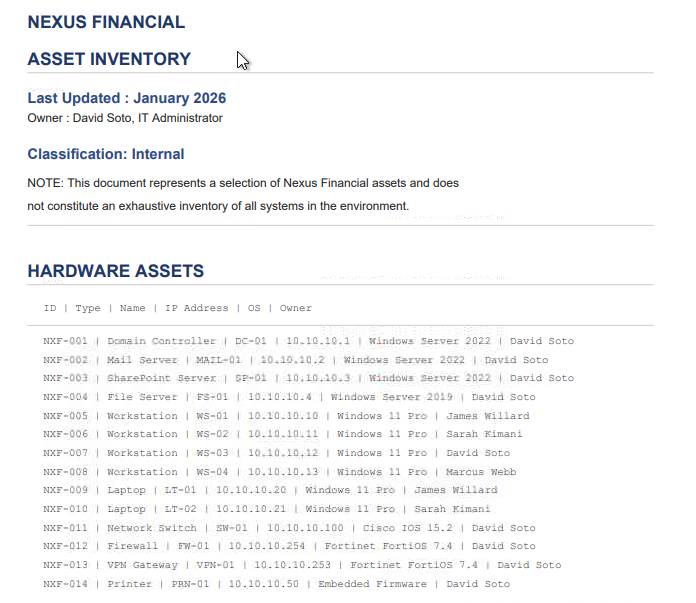
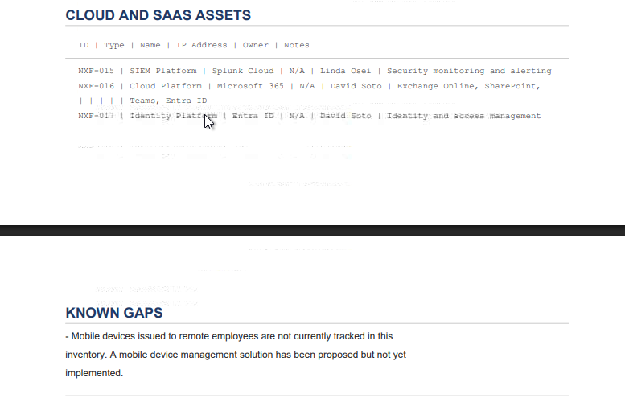
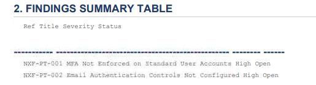
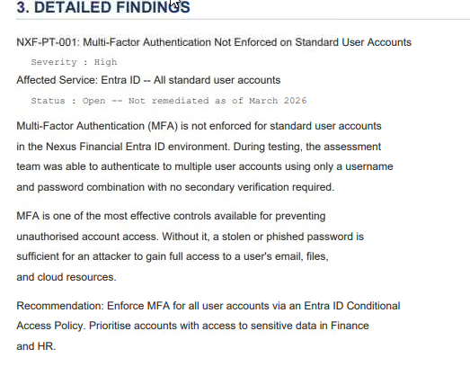
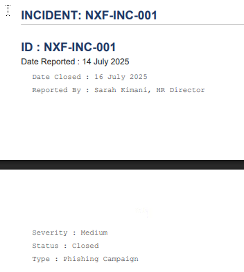
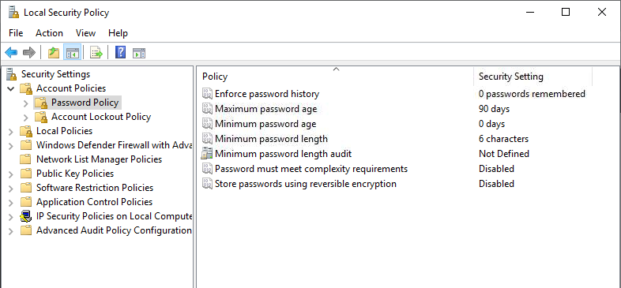
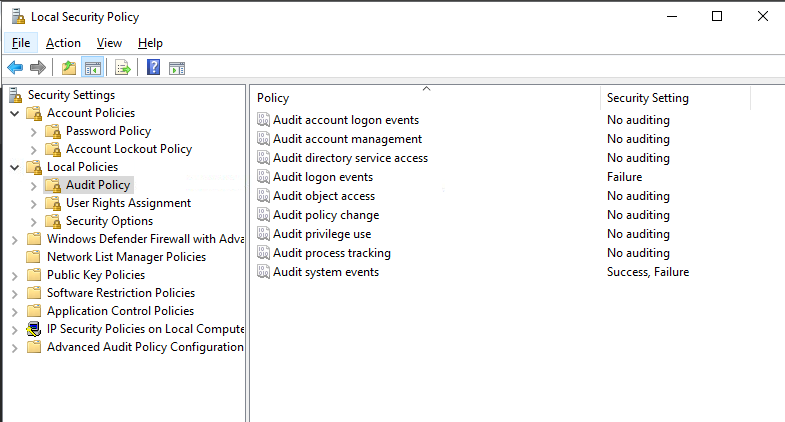

# Preparation

## Overview

I am using the [TryHackMe Preparation room](https://tryhackme.com/room/irpreparation) to examine what an organisation needs **before** a security incident. The practical scenario follows Nexus Financial, a fictional company whose incident continues through the rest of the module. I connect the theory to the lab documents and controls below, with my screenshots displayed beside the observations they support.

I am following the same incident across four rooms:

| Room | What I will do |
| --- | --- |
| **1. Preparation** | Review the people, procedures, assets, and visibility available before the attack. |
| [2. Detection and Analysis](https://tryhackme.com/room/detectionandanalysis) | Triage the alert, investigate in Splunk, and define the incident's scope. |
| [3. Response and Recovery](https://tryhackme.com/room/responseandrecovery) | Make containment and recovery decisions and investigate the cause. |
| [4. Post-Incident Activity](https://tryhackme.com/room/postincidentactivity) | Reconstruct the timeline and turn the lessons into improvements. |

Basic security concepts are enough to start this room. Familiarity with SIEM tools, particularly Splunk, will help when I reach the investigation rooms.

## Why preparation matters to me

Incident response is the organised way I would help a team identify, investigate, contain, and recover from a security incident while limiting damage and preserving evidence. Those actions cannot begin effectively at the moment of crisis if nobody has agreed on responsibilities, escalation, communications, tools, and evidence handling. I see preparation as an operational capability rather than a policy document alone.

### From an event to an incident

I keep these terms separate when I assess a report:

| Term | How I use it |
| --- | --- |
| **Event** | An observed action, such as a sign-in, file access, or network connection. Most events are routine. |
| **Alert** | A signal from a rule or security tool that calls for investigation. It may be benign or malicious. |
| **Incident** | A confirmed security issue that requires a coordinated response under the organisation's procedures. |

I would triage an alert and examine its supporting events before declaring an incident. A detection does not automatically prove compromise. I would also accept leads from outside the SIEM: a user reporting unusual account behaviour, an EDR notification, a partner's report, or a threat intelligence or law-enforcement notification. Each needs assessment and a clear route into the incident process.

In the Nexus Financial scenario, SOC engineers collect events and develop detections, SOC analysts triage alerts, and a compliance team receives reports from partners and other external parties. I would check how those handoffs are documented and how quickly a confirmed issue reaches the response team.

## The response framework I am using

The room teaches the four-phase lifecycle from [NIST SP 800-61 Revision 2](https://csrc.nist.gov/pubs/sp/800/61/r2/final):

| Phase | My focus |
| --- | --- |
| **Preparation** | Establish the team, procedures, access, tools, and logging needed to respond. |
| **Detection and Analysis** | Decide whether the activity is an incident and determine what happened and what is affected. |
| **Containment, Eradication, and Recovery** | Limit further harm, remove the cause and attacker access, and restore trusted operations. |
| **Post-Incident Activity** | Document what happened and feed the lessons back into preparation. |

I use the lifecycle as a repeatable sequence of decisions, not a rigid checklist. Evidence collected during response can change my understanding of the incident, and lessons from one case should improve the next response. SANS PICERL and the NCSC incident management model use different phase names or groupings, but serve a similar purpose: giving responders a shared structure under pressure.

Nexus Financial's IR policy references NIST and defines phases, CSIRT roles, and communications. I want to see whether the supporting controls make that policy usable in practice. **Version note:** this room uses Rev. 2; [NIST SP 800-61 Rev. 3](https://csrc.nist.gov/pubs/sp/800/61/r3/final) superseded it in April 2025. I retain the room's terminology so this write-up matches the exercise.

## Building an incident response capability

### People

I would identify who can declare an incident, lead the investigation, make containment decisions, preserve evidence, and communicate with the business. A dedicated team may be called a CSIRT, CERT, SIRT, or IRT. In a smaller organisation, SOC analysts may take on those duties when an incident is declared, so the transition from alert triage to response must be explicit.

Responders need access to logs, endpoints, cloud platforms, and forensic tools, but I would grant and review that access according to their role rather than leave broad privileges in place indefinitely. I would also check whether analysts practise log analysis and evidence collection, and whether employees know how to report a suspicious email or account action. Training and phishing exercises make the reporting path more likely to work when it matters.

### Processes and records

Documents should tell the team what to do and leave an auditable account of what it did. I would expect to find:

| Item | What I need from it |
| --- | --- |
| **Incident response plan** | Ownership, severity and escalation decisions, communication channels, and measures of response effectiveness. |
| **Communication plan** | Contacts and rules for internal updates, partners, legal counsel, law enforcement, and other outside parties. |
| **Playbooks** | Tested steps for recurring cases such as phishing, ransomware, and data exposure. |
| **Chain of custody record** | Who collected or handled evidence, when they did so, why, and where it was stored. |
| **Case or ticketing system** | A shared timeline of observations, actions, decisions, and their owners. |
| **Asset inventory** | Current systems, software, owners, and business importance so I can scope an incident. |

I would treat previous incident reports and pentest findings as active inputs to this process. Closing a ticket without fixing or accepting its root cause can leave the same path open for the next attacker.

### Technology

No one tool gives me complete coverage. I would check whether each tool is deployed where it is needed, configured correctly, monitored, and understood by the team:

| Capability | What I use it for |
| --- | --- |
| **SIEM** | Centralise and correlate logs, search evidence, and generate alerts. |
| **EDR** | Observe endpoint behaviour and investigate or contain suspicious activity on devices. |
| **IDPS** | Detect suspicious network traffic and, where configured, block it. |
| **DLP** | Identify or prevent unauthorised movement of sensitive data. |
| **Threat intelligence** | Add context to indicators and known attacker infrastructure. |
| **Forensic tools** | Collect and examine disks, memory, packets, and other evidence. |

Nexus Financial has a SIEM in the scenario, and its later investigation uses Microsoft 365 and Entra ID activity. Having the platform is only a starting point; I still need to know what telemetry reaches it and what behaviour the detection rules cover.

## Visibility and detection

I separate **visibility** from **detection**. Visibility means I can observe an action in reliable records. Detection means a rule or analyst recognises the action as potentially malicious in time to act. A missing log source creates a blind spot; a collected log without an appropriate rule creates a detection gap. Either can delay incident discovery.

I would centralise logs, check that collection is enabled on relevant systems, protect records against alteration, and retain enough detail to reconstruct who did what, when, and from where. During an investigation, those records help me build a timeline, identify affected accounts and systems, and test a possible root cause.

| Log type | What it can tell me |
| --- | --- |
| **Event** | Sign-ins, application actions, connections, and other observable activity. |
| **Audit** | A sequence of successful or failed actions, including the actor and result. |
| **Error** | Service failures and application problems that may affect the investigation. |
| **Debug** | Detailed diagnostic information, usually enabled for testing or troubleshooting. |

I would collect from several sources rather than assume the SIEM sees the whole environment: network devices and firewalls; proxies, VPNs, and boundary controls; operating systems on endpoints and servers; and business applications, databases, and cloud services. In Nexus Financial's Microsoft 365 environment, Exchange Online, SharePoint, Teams, and Entra ID records are especially relevant to email, file access, collaboration, and identity activity.

The scenario describes attacker actions that were recorded but did not produce alerts because matching detection rules were absent. I would therefore check both sides of every important use case: **is the event present, and would it alert the team?**

## Practical review: Nexus Financial

I reviewed the screenshots from the `Nexus` documents and the lab workstation's Local Security Policy, opened through `secpol.msc`. They show parts of the asset inventory, the 2025 pentest report, a historic incident record, and local security settings. The images are embedded here so each observation can be checked in context. They do not show the contents of `IR_Policy` or `Communication_Plan`, so I do not make specific claims about those documents beyond the room's description.

### Asset inventory and visibility

The inventory says it was last updated in **January 2026** and explicitly describes itself as a selection of assets, not a complete inventory. The visible hardware entries cover a domain controller, mail and SharePoint servers, a file server, workstations and laptops, and network devices. That gives me useful starting points for scoping, but I would not assume every device is listed.

The cloud section lists **Splunk Cloud**, **Microsoft 365**, and **Entra ID**. Its known-gaps note is more consequential: mobile devices issued to remote employees are not tracked, and a proposed mobile device management solution has not been implemented. I would add those devices and their owners to the inventory before relying on it during an incident.

### Pentest findings

The findings summary records two **High** severity items as **Open**: `NXF-PT-001`, MFA not enforced on standard user accounts, and `NXF-PT-002`, email authentication controls not configured. The summary establishes their status; it does not show the detailed configuration or remediation plan for the second finding.

The detailed view of `NXF-PT-001` says the MFA finding was still open as of **March 2026**. In the assessment, a standard account could authenticate with only a username and password. The report recommends enforcing MFA through an Entra ID Conditional Access policy, prioritising users with access to sensitive Finance and HR data. I would verify the current policy state before marking that recommendation complete.

### Historic phishing incident

The visible record identifies `NXF-INC-001` as a **Medium** severity phishing campaign, reported on **14 July 2025** and closed on **16 July 2025**. The room narrative says the root cause was not fixed, but this screenshot only establishes the incident's type, dates, severity, and closed status. I would inspect the remainder of the incident record before treating its remediation history as independently verified.

### Local Security Policy

On the lab workstation, the Password Policy view shows **zero remembered passwords**, a **six-character minimum**, and **password complexity disabled**. The maximum password age is 90 days and reversible encryption is disabled. These visible settings warrant review; the screenshot alone does not establish which domain or cloud password policies are effective for every Nexus account.

The Audit Policy view records **failure only** for logon events and **success and failure** for system events. Account logon, account management, directory service access, object access, policy change, privilege use, and process tracking show **No auditing** in this local policy view. I would verify the effective audit configuration and whether relevant events actually arrive in Splunk before concluding what the SOC can see.

## Preparation gaps and my next steps

The evidence gives me a practical order of work:

1. Enforce and verify MFA for standard Entra ID accounts, starting with access to sensitive Finance and HR data.
2. Resolve the open email authentication finding and record the deployed controls and validation results.
3. Confirm how `NXF-INC-001` was closed and track any unresolved phishing root cause to a verified fix.
4. Bring remote mobile devices into the asset inventory and implement appropriate management and monitoring.
5. Review the workstation's password and audit policies, confirm the effective settings, and test whether the needed events reach Splunk and generate useful alerts.

The main lesson I take from this phase is that preparation must connect people, procedures, and telemetry. A written policy cannot compensate for an unresolved finding or an alert that never fires. The [Detection and Analysis room](https://tryhackme.com/room/detectionandanalysis) is where I can trace how those earlier gaps affected the incident.

### Sources

- [TryHackMe — Preparation](https://tryhackme.com/room/irpreparation)
- [NIST SP 800-61 Rev. 2 — Computer Security Incident Handling Guide](https://csrc.nist.gov/pubs/sp/800/61/r2/final)
- [NIST SP 800-61 Rev. 3 — Incident Response Recommendations](https://csrc.nist.gov/pubs/sp/800/61/r3/final)
