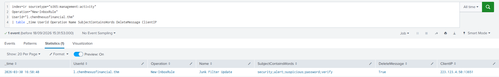
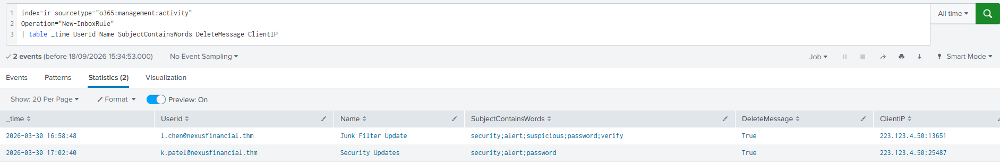
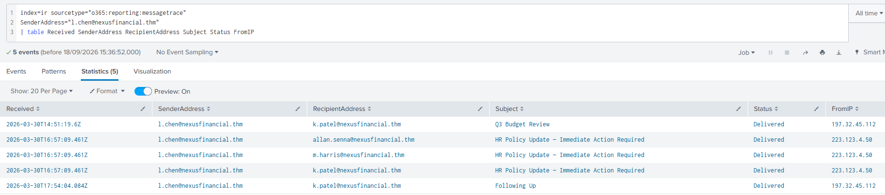
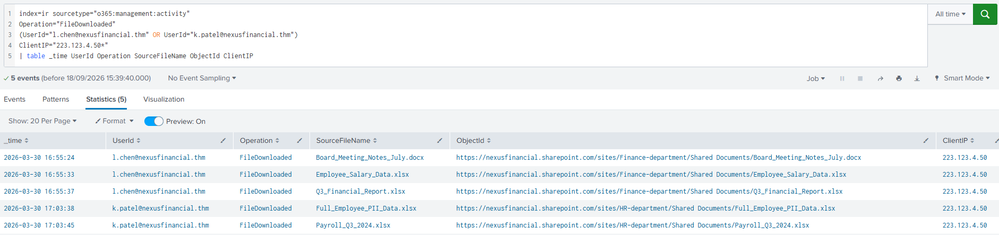
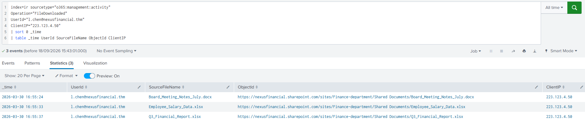
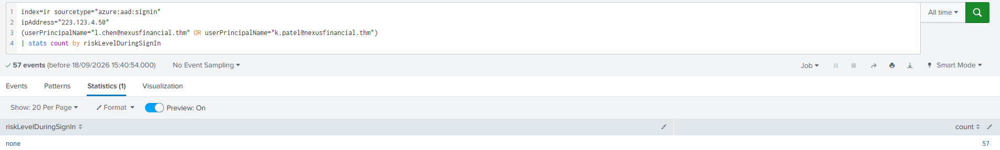

# Recovery and Validation

## Overview

After the Detection and Analysis phase confirmed that the Nexus Financial Microsoft 365 environment had been compromised, I moved into the Response and Recovery phase of the incident.

At this stage, my objective was no longer only to understand what happened. I needed to determine how the attacker should be contained, what malicious activity needed to be removed, and what conditions had to be met before the affected accounts and services could safely return to normal operation.

This phase follows the NIST SP 800-61r2 incident response process and focuses on three closely connected activities:

1. **Containment** – Stop the attacker from causing additional damage.
2. **Eradication** – Remove attacker access and persistence from the environment.
3. **Recovery** – Safely return affected accounts and services to normal operation.

The order is important. Recovery should not begin until containment and eradication have been completed and validated.

---

## Objectives

During this phase, I focused on:

- Investigating post-compromise Microsoft 365 activity in Splunk.
- Identifying persistence created on compromised mailboxes.
- Confirming internal phishing activity.
- Reviewing SharePoint file downloads associated with the attacker.
- Identifying identity-control weaknesses.
- Mapping attacker behaviour to containment and eradication actions.
- Defining the recovery actions required before affected accounts can safely return to normal operation.

---

## Incident Context

The Detection and Analysis phase confirmed that Nexus Financial had been targeted by a phishing attack.

Two Microsoft 365 employee accounts were compromised through credential theft:

- `l.chen@nexusfinancial.thm`
- `k.patel@nexusfinancial.thm`

The confirmed attacker IP used during the post-compromise activity was:

```text
223.123.4.50
```

The initial SIEM alert involved Laura Chen's account:

| Field | Value |
| --- | --- |
| Alert Name | Anomalous Sign-in Detected |
| Time | 2026-03-30 16:41:30 |
| Affected Account | `l.chen@nexusfinancial.thm` |
| Corporate IP | `197.32.45.112` |
| Environment | Microsoft 365 / Entra ID |

Because the attacker operated through cloud identities, the response focused primarily on Microsoft 365 and Entra ID identity controls rather than physical endpoint isolation.

---

## Containment

Containment is intended to stop the attacker from causing additional damage while the IR team prepares for full eradication.

For this incident, the main containment priorities were:

- Disable or restrict compromised identities.
- Revoke active sessions.
- Reset compromised credentials.
- Remove malicious inbox rules.
- Block phishing infrastructure.
- Restrict unauthorized access to SharePoint resources.

### Containment Strategy

I reviewed two containment approaches:

#### Full Isolation

Full isolation immediately cuts off attacker access by disabling compromised identities, revoking sessions, resetting credentials, and removing malicious persistence.

#### Controlled Isolation

Controlled isolation allows limited attacker activity to continue while the IR team monitors the attacker to collect more intelligence about scope, persistence, and objectives.

For this incident, the post-compromise activity first needed to be understood before containment actions were finalized.

---

## MITRE ATT&CK Mapping

| Technique | MITRE ATT&CK ID | Observed Behaviour | Response |
| --- | --- | --- | --- |
| Phishing | T1566 | Phishing emails were used to steal credentials | Block the phishing domain at the email gateway |
| Valid Accounts | T1078 | Stolen credentials were used to authenticate as legitimate users | Disable affected accounts, revoke sessions, and reset passwords |
| Email Hiding Rules | T1564.008 | Inbox rules were created to suppress security-related messages | Remove the malicious inbox rules immediately |
| Data from Information Repositories | T1213 | SharePoint files were downloaded through compromised accounts | Review accessed data, sharing links, and SharePoint permissions |

---

## Splunk Investigation

All practical searches were performed against:

```spl
index=ir
```

The time range was set to **All Time**.

The main log sources used were:

| Log Source | Sourcetype |
| --- | --- |
| Entra ID Sign-in Logs | `azure:aad:signin` |
| Message Trace | `o365:reporting:messagetrace` |
| Unified Audit Logs | `o365:management:activity` |

---

## 1. Malicious Inbox Rule Investigation

I first reviewed inbox-rule creation events on Laura Chen's account.

```spl
index=ir sourcetype="o365:management:activity"
Operation="New-InboxRule"
UserId="l.chen@nexusfinancial.thm"
| table _time UserId Operation Name SubjectContainsWords DeleteMessage ClientIP
```

*Laura Chen malicious inbox rule*



The query identified a suspicious rule created from the attacker infrastructure:

| Field | Value |
| --- | --- |
| User | `l.chen@nexusfinancial.thm` |
| Rule Name | `Junk Filter Update` |
| Filtered Keywords | `security;alert;suspicious;password;verify` |
| DeleteMessage | `True` |
| Client IP | `223.123.4.50:13651` |
| Time | `2026-03-30 16:58:48` |

The rule targeted words commonly found in security notifications and was configured to delete matching messages. This behaviour could prevent the victim from seeing alerts related to suspicious activity, password changes, or account verification.

### Second Compromised Mailbox

I expanded the search to all `New-InboxRule` events:

```spl
index=ir sourcetype="o365:management:activity"
Operation="New-InboxRule"
| table _time UserId Name SubjectContainsWords DeleteMessage ClientIP
```

*Malicious inbox rules on both compromised accounts*



A second malicious rule was identified on `k.patel@nexusfinancial.thm`.

| Account | Rule Name | SubjectContainsWords | DeleteMessage |
| --- | --- | --- | --- |
| `l.chen@nexusfinancial.thm` | `Junk Filter Update` | `security;alert;suspicious;password;verify` | `True` |
| `k.patel@nexusfinancial.thm` | `Security Updates` | `security;alert;password` | `True` |

Both rules were created from the same attacker IP, `223.123.4.50`, which strongly linked the activity across the two compromised accounts.

#### Containment Action

Based on the response guidance for **T1564.008 – Email Hiding Rules**, the required containment action is:

> Remove the malicious inbox rules immediately.

---

## 2. Internal Phishing Investigation

I then reviewed message-trace records for emails sent from Laura Chen's compromised account.

```spl
index=ir sourcetype="o365:reporting:messagetrace"
SenderAddress="l.chen@nexusfinancial.thm"
| table Received SenderAddress RecipientAddress Subject Status FromIP
```

*Internal phishing message trace*



The results showed three messages with the subject:

```text
HR Policy Update — Immediate Action Required
```

These messages originated from the attacker IP `223.123.4.50` and were successfully delivered to:

- `allan.senna@nexusfinancial.thm`
- `m.harris@nexusfinancial.thm`
- `k.patel@nexusfinancial.thm`

Therefore, **3 internal Nexus Financial employees received the internal phishing email**.

The same results also contained legitimate-looking messages originating from the corporate IP `197.32.45.112`. Separating activity by source IP helped distinguish attacker-generated messages from normal account activity.

#### Containment Action

The required response to the phishing infrastructure is:

> Block the phishing domain at the email gateway.

The recipients should also be reviewed for evidence of additional compromise.

---

## 3. SharePoint Data Access Investigation

After reviewing mailbox activity, I searched the Unified Audit Logs for SharePoint downloads performed through both compromised identities from the attacker IP.

```spl
index=ir sourcetype="o365:management:activity"
Operation="FileDownloaded"
(UserId="l.chen@nexusfinancial.thm" OR UserId="k.patel@nexusfinancial.thm")
ClientIP="223.123.4.50*"
| table _time UserId Operation SourceFileName ObjectId ClientIP
```

*SharePoint downloads across both compromised accounts*



The investigation identified **5 files downloaded from SharePoint**:

| Time | Compromised Account | File |
| --- | --- | --- |
| 2026-03-30 16:55:24 | `l.chen@nexusfinancial.thm` | `Board_Meeting_Notes_July.docx` |
| 2026-03-30 16:55:33 | `l.chen@nexusfinancial.thm` | `Employee_Salary_Data.xlsx` |
| 2026-03-30 16:55:37 | `l.chen@nexusfinancial.thm` | `Q3_Financial_Report.xlsx` |
| 2026-03-30 17:03:38 | `k.patel@nexusfinancial.thm` | `Full_Employee_PII_Data.xlsx` |
| 2026-03-30 17:03:45 | `k.patel@nexusfinancial.thm` | `Payroll_Q3_2024.xlsx` |

The file names indicate that the attacker accessed potentially sensitive financial, payroll, employee, and PII-related information.

### Laura Chen Download Timeline

To determine the first file downloaded through Laura Chen's account, I sorted her download events by time:

```spl
index=ir sourcetype="o365:management:activity"
Operation="FileDownloaded"
UserId="l.chen@nexusfinancial.thm"
ClientIP="223.123.4.50"
| sort 0 _time
| table _time UserId SourceFileName ObjectId ClientIP
```

*Laura Chen SharePoint downloads*



The first observed download was:

```text
Board_Meeting_Notes_July.docx
```

at:

```text
2026-03-30 16:55:24
```

This was followed by `Employee_Salary_Data.xlsx` and `Q3_Financial_Report.xlsx`.

#### Eradication Action

Any external sharing links created by the attacker should be removed during eradication.

The required action from the response exercise is:

> Revoking all external sharing links created by the attacker from SharePoint.

---

## 4. Identity Risk and Authentication Controls

I investigated the sign-in records associated with the attacker IP across both compromised identities.

```spl
index=ir sourcetype="azure:aad:signin"
ipAddress="223.123.4.50"
(userPrincipalName="l.chen@nexusfinancial.thm" OR userPrincipalName="k.patel@nexusfinancial.thm")
| stats count by riskLevelDuringSignIn
```

*Microsoft sign-in risk level*



The search returned **57 sign-in events**, all with:

```text
riskLevelDuringSignIn = none
```

This means Microsoft's risk engine did not assign a risk level to these attacker sign-ins in the available dataset, despite the activity being associated with the confirmed attacker IP.

The response exercise also identified that **MFA was absent**, allowing the compromised credentials to be used without an additional authentication factor.

---

## Eradication

Containment limits further damage, but eradication must remove attacker access and persistence before recovery begins.

For this Microsoft 365 compromise, the required eradication actions include:

- Reset compromised passwords.
- Revoke active sessions.
- Remove both malicious inbox rules.
- Review and remove unauthorized forwarding rules or mailbox delegates.
- Review and revoke suspicious OAuth permissions.
- Confirm that no additional accounts authenticated from `223.123.4.50`.
- Revoke unauthorized external SharePoint sharing links.
- Review SharePoint permissions.
- Enforce MFA before compromised accounts are returned to normal use.

---

## Recovery Plan

Recovery should only begin after the attacker has been contained and persistence has been removed.

### Near-Term Actions

The most critical actions should be performed before affected accounts are re-enabled:

- Reset compromised passwords.
- Revoke existing sessions.
- **Enforce MFA.**
- Remove malicious inbox rules.
- Remove unauthorized forwarding rules or delegates.
- Revoke suspicious OAuth permissions.
- Revoke unauthorized SharePoint sharing links.
- Confirm that the attacker no longer has active access.

MFA enforcement therefore belongs in the **Near term** recovery timeframe.

### Mid-Term Actions

- Configure and validate SPF.
- Configure DKIM.
- Implement DMARC.
- Review SharePoint permissions.
- Implement Conditional Access policies.
- Improve Microsoft 365 identity protections.
- Review mailbox security settings.

### Long-Term Actions

- Expand SIEM detection coverage.
- Improve identity-based detection rules.
- Conduct phishing simulations.
- Improve security awareness training.
- Review Incident Response playbooks.
- Define clear escalation timelines.
- Regularly review Microsoft 365 permissions.
- Monitor risky sign-in behaviour.
- Test the Incident Response process regularly.

---

## Recovery Validation

The practical lab provided evidence of attacker activity and the controls that should be applied. It did not represent proof that every remediation action had already been executed.

Before returning the affected identities to normal use, I would validate:

| Validation Item | Required |
| --- | --- |
| Compromised passwords reset | Yes |
| Existing sessions revoked | Yes |
| MFA enforced | Yes |
| Malicious inbox rules removed | Yes |
| Forwarding rules reviewed | Yes |
| Mailbox delegates reviewed | Yes |
| OAuth permissions reviewed | Yes |
| External SharePoint links revoked/reviewed | Yes |
| Additional accounts investigated | Yes |
| Attacker IP no longer observed | Yes |
| No additional persistence identified | Yes |
| Security monitoring active | Yes |

I would only consider recovery complete after these checks were performed and no continuing attacker activity was identified.

---

## Evidence Summary

| Evidence | Finding |
| --- | --- |
| Confirmed attacker IP | `223.123.4.50` |
| Compromised Account 1 | `l.chen@nexusfinancial.thm` |
| Compromised Account 2 | `k.patel@nexusfinancial.thm` |
| Laura inbox rule | `Junk Filter Update` |
| Laura rule keywords | `security;alert;suspicious;password;verify` |
| Laura `DeleteMessage` | `True` |
| Second inbox rule | `Security Updates` |
| Internal phishing recipients | `3` |
| SharePoint files downloaded | `5` |
| First Laura download | `Board_Meeting_Notes_July.docx` |
| Attacker sign-in risk level | `none` |
| Attacker-IP sign-in events in risk query | `57` |
| Missing authentication control | `MFA` |
| MFA recovery timeframe | `Near term` |

---

## Key Takeaways

From this phase of the investigation, I learned that:

- Containment stops additional damage but does not mean the attacker has been removed.
- Cloud identity compromises require identity-focused response actions.
- Malicious inbox rules can be used as persistence and to hide security notifications.
- Internal phishing from a compromised account can expand the incident to additional users.
- SharePoint audit data can show exactly which sensitive files were accessed or downloaded.
- Source IP correlation can separate attacker activity from normal account activity.
- A risk engine result of `none` does not by itself prove that activity is benign.
- Password resets alone are not enough if active sessions, mailbox rules, OAuth permissions, or other persistence remain.
- MFA should be enforced as a near-term recovery action before compromised accounts are restored.
- Recovery should only begin after containment and eradication have been validated.

---

## Final Assessment

The practical investigation confirmed that the attacker used two compromised Microsoft 365 identities to establish mailbox persistence, conduct internal phishing, and access sensitive SharePoint files.

The evidence linked the activity through the attacker IP `223.123.4.50`, including malicious inbox-rule creation, phishing messages, SharePoint downloads, and repeated sign-in activity.

The investigation therefore supports an identity-focused response: remove malicious mailbox rules, block phishing infrastructure, revoke attacker-created sharing links, reset and secure compromised identities, revoke active sessions, enforce MFA, and validate that no additional attacker access remains before returning the accounts to normal operation.

---


Incident Response Module – Room 3 of 4

The practical investigation is based on the Nexus Financial Microsoft 365 incident provided in the TryHackMe lab environment.
